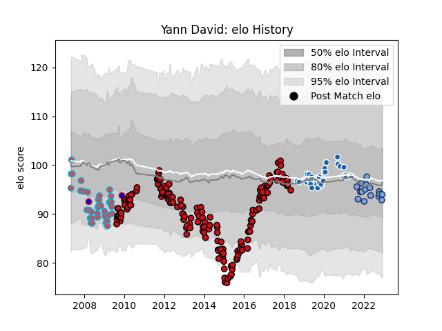

---  
layout: page  
title: Yann David  
date: 2022-12-12 14:47:26.855953  
categories: player  
---
# Yann David

## Positions: C

## Country: France

## Current elo: 94.0

## Current Percentile: 40.0

# Elo History

# Match History

| Team              |   Appearances |   Win Rate |
|:------------------|--------------:|-----------:|
| Stade Toulousain  |           174 |   0.583333 |
| Bourgoin-Jallieu  |            36 |   0.416667 |
| Castres Olympique |            32 |   0.59375  |
| Bayonne           |            16 |   0.625    |
| France            |             2 |   1        |

| Opponent             |   Matches |   Win Rate |
|:---------------------|----------:|-----------:|
| Clermont Auvergne    |        18 |   0.277778 |
| Brive                |        17 |   0.617647 |
| Castres Olympique    |        15 |   0.533333 |
| Montpellier Herault  |        14 |   0.642857 |
| Stade Francais Paris |        14 |   0.535714 |
| Toulon               |        13 |   0.230769 |
| Agen                 |        12 |   0.875    |
| Racing 92            |        12 |   0.333333 |
| Lyon                 |        12 |   0.833333 |
| Bayonne              |        12 |   0.5      |
| Bordeaux Begles      |        10 |   0.55     |
| Perpignan            |        10 |   0.2      |
| Grenoble             |         9 |   0.444444 |
| Biarritz Olympique   |         8 |   0.625    |
| Oyonnax              |         8 |   0.75     |
| La Rochelle          |         8 |   0.5      |
| Connacht             |         5 |   0.6      |
| Albi                 |         4 |   0.75     |
| Stade Toulousain     |         4 |   0.25     |
| Montauban            |         4 |   0.75     |
| Harlequins           |         4 |   0.75     |
| Pau                  |         3 |   0.666667 |
| Narbonne             |         3 |   1        |
| Mont-de-Marsan       |         3 |   0.833333 |
| Zebre                |         3 |   1        |
| Dax                  |         3 |   0.666667 |
| Bourgoin-Jallieu     |         2 |   0.5      |
| Worcester Warriors   |         2 |   1        |
| Glasgow Warriors     |         2 |   1        |
| Wasps                |         2 |   0.25     |
| Nevers               |         2 |   0.75     |
| Ospreys              |         2 |   0.5      |
| Dragons              |         2 |   0.5      |
| Carcassonne          |         2 |   0.5      |
| Sale Sharks          |         2 |   1        |
| Saracens             |         2 |   0.5      |
| Leinster             |         1 |   1        |
| Vannes               |         1 |   1        |
| Auch                 |         1 |   1        |
| Bath Rugby           |         1 |   0        |
| RC Enisei            |         1 |   1        |
| South Africa         |         1 |   1        |
| Italy                |         1 |   1        |
| Colomiers            |         1 |   1        |
| Northampton Saints   |         1 |   0        |
| Edinburgh            |         1 |   0        |
| Gloucester Rugby     |         1 |   1        |
| London Irish         |         1 |   1        |