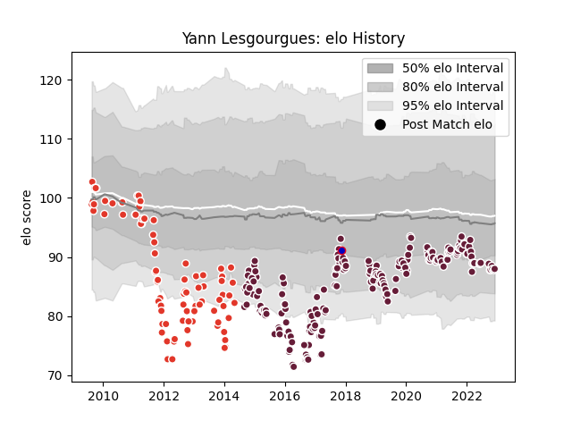

---  
layout: page  
title: Yann Lesgourgues  
date: 2022-12-09 13:10:46.712722  
categories: player  
---
# Yann Lesgourgues

## Positions: SH

## Country: France

## Current elo: 88.0

## Current Percentile: 18.0

# Elo History

# Match History

| Team               |   Appearances |   Win Rate |
|:-------------------|--------------:|-----------:|
| Bordeaux Begles    |           189 |   0.539683 |
| Biarritz Olympique |            87 |   0.425287 |
| France             |             1 |   0        |

| Opponent             |   Matches |   Win Rate |
|:---------------------|----------:|-----------:|
| Clermont Auvergne    |        22 |   0.318182 |
| Stade Toulousain     |        19 |   0.289474 |
| Racing 92            |        18 |   0.444444 |
| Toulon               |        17 |   0.411765 |
| Castres Olympique    |        17 |   0.382353 |
| Stade Francais Paris |        15 |   0.533333 |
| Lyon                 |        15 |   0.5      |
| La Rochelle          |        14 |   0.428571 |
| Brive                |        14 |   0.75     |
| Montpellier Herault  |        13 |   0.384615 |
| Bayonne              |        13 |   0.538462 |
| Perpignan            |        12 |   0.541667 |
| Agen                 |        12 |   0.875    |
| Pau                  |        11 |   0.454545 |
| Grenoble             |         8 |   0.75     |
| Oyonnax              |         7 |   0.571429 |
| Edinburgh            |         4 |   0.5      |
| Bordeaux Begles      |         4 |   0.25     |
| Exeter Chiefs        |         3 |   0.666667 |
| Sale Sharks          |         3 |   0.333333 |
| Wasps                |         3 |   1        |
| Connacht             |         3 |   0.333333 |
| Newcastle Falcons    |         2 |   0        |
| Ulster               |         2 |   1        |
| Worcester Warriors   |         2 |   1        |
| Zebre                |         2 |   1        |
| Harlequins           |         2 |   0        |
| Gloucester Rugby     |         2 |   0.5      |
| Glasgow Warriors     |         2 |   1        |
| Bourgoin-Jallieu     |         2 |   0.5      |
| Biarritz Olympique   |         2 |   0.5      |
| Benetton Treviso     |         2 |   0.5      |
| New Zealand          |         1 |   0        |
| Ospreys              |         1 |   1        |
| Mont-de-Marsan       |         1 |   1        |
| Albi                 |         1 |   1        |
| Leinster             |         1 |   0        |
| RC Enisei            |         1 |   1        |
| Saracens             |         1 |   1        |
| Bristol Rugby        |         1 |   0        |
| Bath Rugby           |         1 |   1        |
| London Welsh         |         1 |   1        |