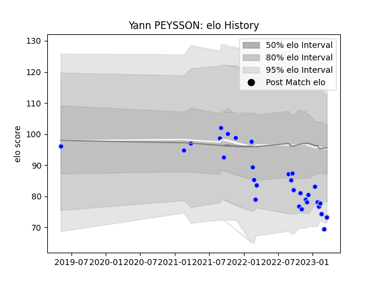

---  
layout: page  
title: Yann PEYSSON  
date: 2023-01-31 10:55:18.682004  
categories: player  
---
# Yann PEYSSON

## Positions: N8

## Current elo: 92.0

## Current Percentile: 30.0

# Elo History

# Match History

| Team      |   Appearances |   Win Rate |
|:----------|--------------:|-----------:|
| Colomiers |            25 |       0.68 |

| Opponent           |   Matches |   Win Rate |
|:-------------------|----------:|-----------:|
| Provence Rugby     |         3 |   0.666667 |
| Aurillac           |         2 |   0        |
| Beziers            |         2 |   1        |
| Biarritz Olympique |         2 |   0.5      |
| Grenoble           |         2 |   1        |
| Nevers             |         2 |   0.5      |
| Oyonnax            |         2 |   1        |
| Soyaux-Angouleme   |         2 |   1        |
| Agen               |         1 |   1        |
| Bayonne            |         1 |   0        |
| Carcassonne        |         1 |   1        |
| Massy              |         1 |   1        |
| Mont-de-Marsan     |         1 |   0        |
| Narbonne           |         1 |   1        |
| Rouen              |         1 |   1        |
| Vannes             |         1 |   0        |