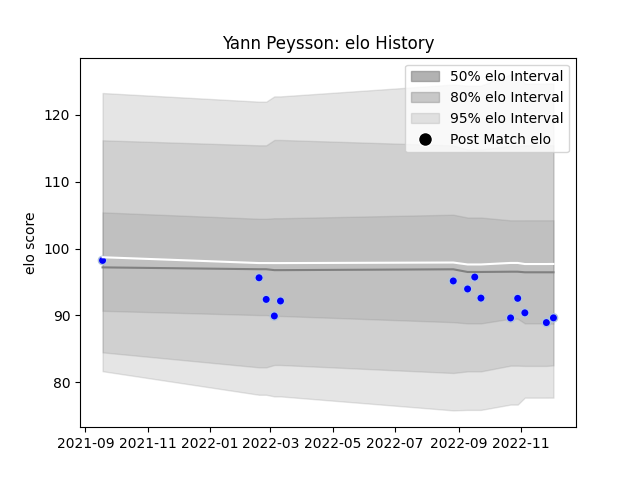

---  
layout: page  
title: Yann Peysson  
date: 2022-12-14 11:16:10.049365  
categories: player  
---
# Yann Peysson

## Positions: N8

## Current elo: 91.0

## Current Percentile: 25.0

# Elo History

# Match History

| Team      |   Appearances |   Win Rate |
|:----------|--------------:|-----------:|
| Colomiers |            15 |   0.666667 |

| Opponent           |   Matches |   Win Rate |
|:-------------------|----------:|-----------:|
| Grenoble           |         2 |          1 |
| Agen               |         1 |          1 |
| Aurillac           |         1 |          0 |
| Bayonne            |         1 |          0 |
| Beziers            |         1 |          1 |
| Biarritz Olympique |         1 |          0 |
| Carcassonne        |         1 |          1 |
| Massy              |         1 |          1 |
| Mont-de-Marsan     |         1 |          0 |
| Nevers             |         1 |          1 |
| Provence Rugby     |         1 |          1 |
| Rouen              |         1 |          1 |
| Soyaux-Angouleme   |         1 |          1 |
| Vannes             |         1 |          0 |