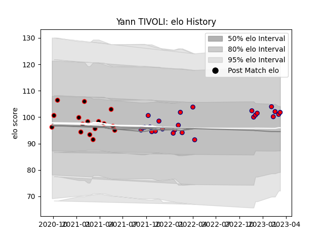

---  
layout: page  
title: Yann TIVOLI  
date: 2023-03-09 10:08:13.039951  
categories: player  
---
# Yann TIVOLI

## Positions: L, FL

## Current elo: 107.0

## Current Percentile: 77.0

# Elo History

# Match History

| Team     |   Appearances |   Win Rate |
|:---------|--------------:|-----------:|
| Aurillac |            24 |   0.541667 |
| Nice     |            16 |   0.8125   |

| Opponent                   |   Matches |   Win Rate |
|:---------------------------|----------:|-----------:|
| Nevers                     |         4 |   0.5      |
| US Bressane                |         3 |   0.666667 |
| Colomiers                  |         3 |   0.666667 |
| Massy                      |         3 |   1        |
| Aubenas                    |         2 |   1        |
| Bourgoin-Jallieu           |         2 |   1        |
| Carcassonne                |         2 |   1        |
| Chambery                   |         2 |   1        |
| Oyonnax                    |         2 |   0        |
| Grenoble                   |         2 |   0.5      |
| Mont-de-Marsan             |         2 |   0        |
| Narbonne                   |         2 |   0.5      |
| Agen                       |         1 |   0        |
| Tarbes                     |         1 |   1        |
| Suresnes                   |         1 |   1        |
| Rouen                      |         1 |   1        |
| Dijon                      |         1 |   1        |
| Albi                       |         1 |   0        |
| Dax                        |         1 |   0        |
| Cognac Saint Jean d'Angély |         1 |   1        |
| Beziers                    |         1 |   1        |
| Bayonne                    |         1 |   0        |
| Vannes                     |         1 |   1        |