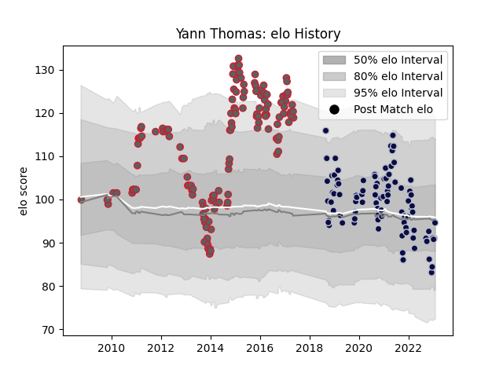

---  
layout: page  
title: Yann Thomas  
date: 2023-03-21 18:21:50.375611  
categories: player  
---
# Yann Thomas

Last updated: 2023-03-21
## Positions: P

## Current elo: 99.0

## Current Percentile: 46.0

# Elo History

# Match History

| Team             |   Appearances |   Win Rate |
|:-----------------|--------------:|-----------:|
| Gloucester Rugby |           150 |   0.51     |
| Bristol Rugby    |            98 |   0.556122 |

| Opponent               |   Matches |   Win Rate |
|:-----------------------|----------:|-----------:|
| Northampton Saints     |        22 |   0.431818 |
| Wasps                  |        20 |   0.35     |
| Harlequins             |        18 |   0.416667 |
| Newcastle Falcons      |        17 |   0.588235 |
| Sale Sharks            |        16 |   0.34375  |
| Bath Rugby             |        16 |   0.53125  |
| London Irish           |        16 |   0.625    |
| Exeter Chiefs          |        16 |   0.34375  |
| Worcester Warriors     |        15 |   0.633333 |
| Saracens               |        13 |   0.384615 |
| Leicester Tigers       |        12 |   0.416667 |
| Zebre                  |         9 |   0.888889 |
| La Rochelle            |         8 |   0.5      |
| Dragons                |         5 |   0.6      |
| Gloucester Rugby       |         5 |   0.6      |
| London Welsh           |         4 |   1        |
| Edinburgh              |         4 |   0.75     |
| Cardiff Blues          |         3 |   0.666667 |
| Brive                  |         3 |   1        |
| Perpignan              |         3 |   1        |
| Bordeaux Begles        |         3 |   0.333333 |
| Yorkshire Carnegie     |         2 |   0.5      |
| Munster                |         2 |   0        |
| Bayonne                |         2 |   1        |
| Ospreys                |         2 |   0.5      |
| Oyonnax                |         2 |   1        |
| Enisey-STM Krasnoyarsk |         1 |   1        |
| Stade Francais Paris   |         1 |   0        |
| Benetton Treviso       |         1 |   1        |
| Toulon                 |         1 |   1        |
| RC Enisei              |         1 |   1        |
| Scarlets               |         1 |   1        |
| Biarritz Olympique     |         1 |   0        |
| Bristol Rugby          |         1 |   1        |
| Mont-de-Marsan         |         1 |   1        |
| Agen                   |         1 |   1        |