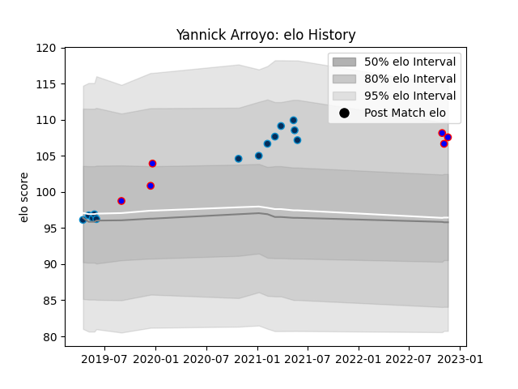

---  
layout: page  
title: Yannick Arroyo  
date: 2023-01-13 11:33:59.347628  
categories: player  
---
# Yannick Arroyo

## Positions: P

## Current elo: 93.0

## Current Percentile: 64.0

# Elo History

# Match History

| Team                |   Appearances |   Win Rate |
|:--------------------|--------------:|-----------:|
| Montpellier Herault |            13 |   0.615385 |
| Beziers             |            12 |   0.333333 |

| Opponent             |   Matches |   Win Rate |
|:---------------------|----------:|-----------:|
| Stade Francais Paris |         3 |   0.666667 |
| Vannes               |         2 |   0        |
| Clermont Auvergne    |         2 |   1        |
| Lyon                 |         2 |   0        |
| Nevers               |         2 |   0        |
| Provence Rugby       |         1 |   0        |
| Toulon               |         1 |   1        |
| Stade Toulousain     |         1 |   1        |
| Roval Drome XV       |         1 |   1        |
| Rouen                |         1 |   1        |
| Racing 92            |         1 |   0        |
| Aurillac             |         1 |   0        |
| Perpignan            |         1 |   0        |
| Bordeaux Begles      |         1 |   0        |
| Montauban            |         1 |   1        |
| Castres Olympique    |         1 |   1        |
| Carcassonne          |         1 |   1        |
| Brive                |         1 |   1        |
| Oyonnax              |         1 |   0        |