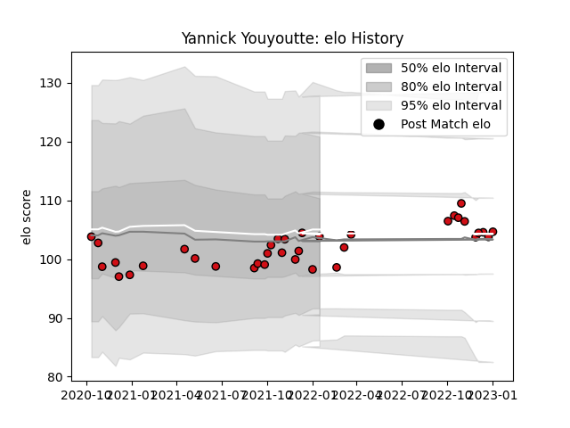

---  
layout: page  
title: Yannick Youyoutte  
date: 2022-12-14 11:19:04.603712  
categories: player  
---
# Yannick Youyoutte

## Positions: FL, L

## Current elo: 96.0

## Current Percentile: 51.0

# Elo History

# Match History

| Team             |   Appearances |   Win Rate |
|:-----------------|--------------:|-----------:|
| Stade Toulousain |            32 |   0.640625 |

| Opponent             |   Matches |   Win Rate |
|:---------------------|----------:|-----------:|
| Bordeaux Begles      |         3 |   0.666667 |
| Stade Francais Paris |         3 |   0.166667 |
| Agen                 |         2 |   1        |
| Bayonne              |         2 |   0.5      |
| Brive                |         2 |   1        |
| Castres Olympique    |         2 |   0.5      |
| Clermont Auvergne    |         2 |   0.5      |
| La Rochelle          |         2 |   1        |
| Lyon                 |         2 |   0        |
| Montpellier Herault  |         2 |   1        |
| Pau                  |         2 |   0.5      |
| Perpignan            |         2 |   1        |
| Racing 92            |         2 |   0.5      |
| Toulon               |         2 |   0.5      |
| Biarritz Olympique   |         1 |   1        |
| Munster              |         1 |   1        |