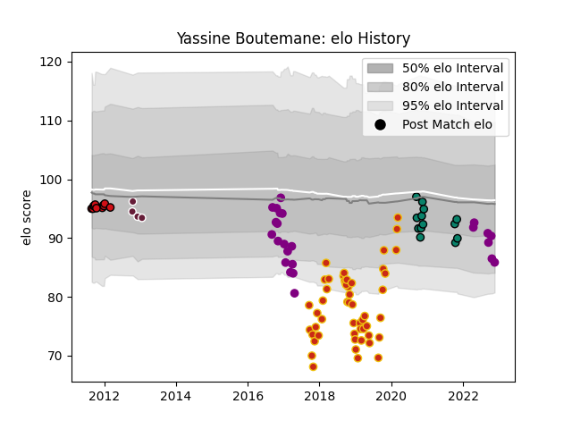

---  
layout: page  
title: Yassine Boutemane  
date: 2022-12-18 16:22:43.714724  
categories: player  
---
# Yassine Boutemane

## Positions: P

## Current elo: 87.0

## Current Percentile: 21.0

# Elo History

# Match History

| Team             |   Appearances |   Win Rate |
|:-----------------|--------------:|-----------:|
| Perpignan        |            51 |   0.382353 |
| Soyaux-Angouleme |            28 |   0.410714 |
| Montauban        |            13 |   0.576923 |
| Stade Toulousain |            11 |   0.727273 |
| Bordeaux Begles  |             4 |   0        |

| Opponent             |   Matches |   Win Rate |
|:---------------------|----------:|-----------:|
| Agen                 |         6 |   0.166667 |
| Biarritz Olympique   |         6 |   0.833333 |
| Mont-de-Marsan       |         6 |   0.5      |
| Grenoble             |         6 |   0.583333 |
| Montauban            |         5 |   0.6      |
| Aurillac             |         5 |   0.4      |
| Vannes               |         4 |   0.75     |
| Beziers              |         4 |   0.25     |
| Rouen                |         3 |   0.666667 |
| Oyonnax              |         3 |   0        |
| Massy                |         3 |   0.666667 |
| Perpignan            |         3 |   0.166667 |
| Provence Rugby       |         3 |   0.333333 |
| Racing 92            |         3 |   0.333333 |
| Bordeaux Begles      |         3 |   0.166667 |
| Colomiers            |         3 |   0.666667 |
| Clermont Auvergne    |         3 |   0.333333 |
| Castres Olympique    |         3 |   0        |
| Montpellier Herault  |         3 |   0.666667 |
| Soyaux-Angouleme     |         2 |   1        |
| Narbonne             |         2 |   1        |
| Stade Toulousain     |         2 |   0        |
| Pau                  |         2 |   0        |
| Toulon               |         2 |   0        |
| Nevers               |         2 |   0.5      |
| London Irish         |         2 |   0        |
| Bayonne              |         2 |   0.5      |
| Lyon                 |         2 |   0.5      |
| Albi                 |         2 |   0.5      |
| La Rochelle          |         2 |   0        |
| Carcassonne          |         2 |   0.5      |
| Bourgoin-Jallieu     |         1 |   1        |
| Harlequins           |         1 |   1        |
| Gloucester Rugby     |         1 |   0        |
| Sale Sharks          |         1 |   0        |
| Dax                  |         1 |   1        |
| Stade Francais Paris |         1 |   0        |
| Connacht             |         1 |   0        |
| Aubenas              |         1 |   1        |