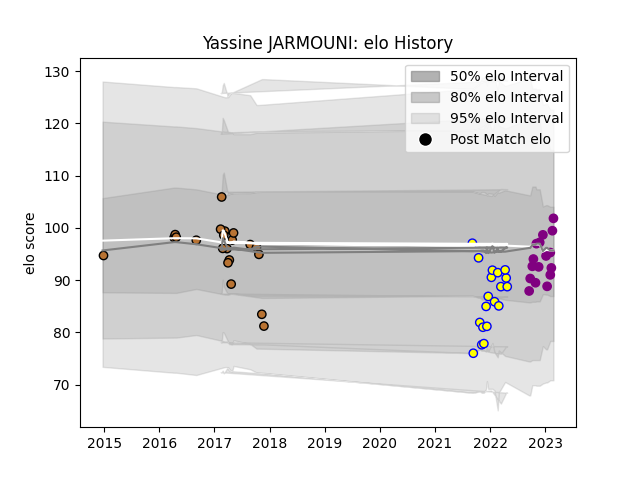

---  
layout: page  
title: Yassine JARMOUNI  
date: 2023-03-29 11:29:10.904513  
categories: player  
---
# Yassine JARMOUNI

Last updated: 2023-03-29
## Positions: N8, FL

## Current elo: 93.0

## Current Percentile: 43.0

# Elo History

# Match History

| Team             |   Appearances |   Win Rate |
|:-----------------|--------------:|-----------:|
| Narbonne         |            21 |   0.333333 |
| Aubenas          |            19 |   0.315789 |
| Soyaux-Angouleme |            17 |   0.470588 |

| Opponent                   |   Matches |   Win Rate |
|:---------------------------|----------:|-----------:|
| Bourgoin-Jallieu           |         4 |   0.75     |
| Mont-de-Marsan             |         4 |   0        |
| Grenoble                   |         3 |   0.333333 |
| Soyaux-Angouleme           |         3 |   0.333333 |
| Perpignan                  |         3 |   0        |
| Carcassonne                |         3 |   0.666667 |
| Massy                      |         3 |   0.666667 |
| Dax                        |         2 |   1        |
| Valence Romans Drome Rugby |         2 |   0        |
| Nevers                     |         2 |   0        |
| Montauban                  |         2 |   0.5      |
| Agen                       |         2 |   0.5      |
| Colomiers                  |         2 |   0.5      |
| Aurillac                   |         2 |   0.5      |
| Cognac Saint Jean d'Angély |         2 |   1        |
| Chambery                   |         2 |   0.5      |
| Blagnac                    |         2 |   0        |
| Biarritz Olympique         |         2 |   0.5      |
| Beziers                    |         2 |   0.5      |
| Rouen                      |         1 |   0        |
| Tarbes                     |         1 |   0        |
| Suresnes                   |         1 |   1        |
| Bayonne                    |         1 |   0        |
| Oyonnax                    |         1 |   0        |
| Provence Rugby             |         1 |   0        |
| Dijon                      |         1 |   0        |
| Nice                       |         1 |   0        |
| Albi                       |         1 |   0        |
| Vannes                     |         1 |   0        |