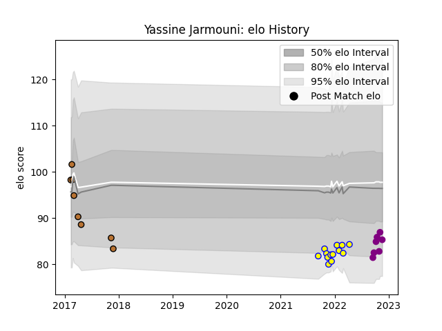

---  
layout: page  
title: Yassine Jarmouni  
date: 2022-11-22 11:43:00.938844  
categories: player  
---
# Yassine Jarmouni

## Positions: FL, N8

## Current elo: 85.0

## Current Percentile: 18.0

# Elo History

# Match History

| Team             |   Appearances |   Win Rate |
|:-----------------|--------------:|-----------:|
| Aubenas          |            13 |   0.307692 |
| Narbonne         |             8 |   0.375    |
| Soyaux-Angouleme |             7 |   0.428571 |

| Opponent                   |   Matches |   Win Rate |
|:---------------------------|----------:|-----------:|
| Agen                       |         2 |        0.5 |
| Biarritz Olympique         |         2 |        0.5 |
| Carcassonne                |         2 |        0.5 |
| Chambery                   |         2 |        0.5 |
| Dax                        |         2 |        1   |
| Mont-de-Marsan             |         2 |        0   |
| Massy                      |         1 |        0   |
| Tarbes                     |         1 |        0   |
| Suresnes                   |         1 |        1   |
| Soyaux-Angouleme           |         1 |        0   |
| Provence Rugby             |         1 |        0   |
| Nice                       |         1 |        0   |
| Nevers                     |         1 |        0   |
| Dijon                      |         1 |        0   |
| Grenoble                   |         1 |        0   |
| Albi                       |         1 |        0   |
| Colomiers                  |         1 |        0   |
| Cognac Saint Jean d'Angély |         1 |        1   |
| Blagnac                    |         1 |        0   |
| Beziers                    |         1 |        1   |
| Aurillac                   |         1 |        1   |
| Valence Romans Drome Rugby |         1 |        0   |