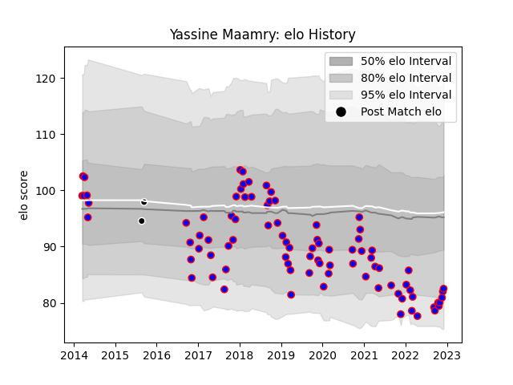

---  
layout: page  
title: Yassine Maamry  
date: 2022-12-09 13:20:35.736648  
categories: player  
---
# Yassine Maamry

## Positions: L

## Current elo: 83.0

## Current Percentile: 7.0

# Elo History

# Match History

| Team           |   Appearances |   Win Rate |
|:---------------|--------------:|-----------:|
| Beziers        |            87 |   0.471264 |
| Provence Rugby |             2 |   0.5      |

| Opponent           |   Matches |   Win Rate |
|:-------------------|----------:|-----------:|
| Mont-de-Marsan     |        10 |   0.4      |
| Aurillac           |         8 |   0.375    |
| Oyonnax            |         7 |   0.285714 |
| Montauban          |         7 |   0.714286 |
| Nevers             |         6 |   0.166667 |
| Biarritz Olympique |         5 |   0.4      |
| Soyaux-Angouleme   |         5 |   0.4      |
| Carcassonne        |         5 |   0.4      |
| Massy              |         5 |   1        |
| Provence Rugby     |         4 |   0.25     |
| Perpignan          |         4 |   0.75     |
| Grenoble           |         3 |   0.666667 |
| US Bressane        |         2 |   0.5      |
| Rouen              |         2 |   0.5      |
| Vannes             |         2 |   0.5      |
| Narbonne           |         2 |   0        |
| Albi               |         2 |   0.5      |
| Dax                |         2 |   1        |
| Colomiers          |         2 |   0.5      |
| Bourgoin-Jallieu   |         2 |   0.5      |
| La Rochelle        |         1 |   0        |
| Roval Drome XV     |         1 |   1        |
| Brive              |         1 |   0        |
| Agen               |         1 |   1        |