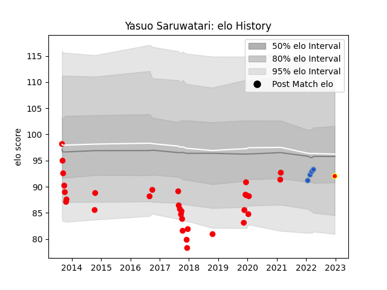

---  
layout: page  
title: Yasuo Saruwatari  
date: 2023-03-21 18:09:07.122469  
categories: player  
---
# Yasuo Saruwatari

Last updated: 2023-03-21
## Positions: P

## Current elo: 80.0

## Current Percentile: 13.0

# Elo History

# Match History

| Team                 |   Appearances |   Win Rate |
|:---------------------|--------------:|-----------:|
| Coca-Cola Red Sparks |            40 |   0.25     |
| Kyuden Voltex        |             6 |   0.833333 |
| Munakata Sanix Blues |             4 |   1        |

| Opponent                          |   Matches |   Win Rate |
|:----------------------------------|----------:|-----------:|
| Kurita Water Gush                 |         6 |   1        |
| Yokohama Canon Eagles             |         4 |   0        |
| Hanazono Kintetsu Liners          |         4 |   0        |
| Kubota Spears Funabashi Tokyo-Bay |         3 |   0        |
| Toyota Industries Shuttles Aichi  |         3 |   0.333333 |
| Black Rams Tokyo                  |         3 |   0.166667 |
| Saitama Wild Knights              |         2 |   0        |
| Toshiba Brave Lupus Tokyo         |         2 |   0        |
| Kyuden Voltex                     |         2 |   1        |
| Chugoku Red Regulions             |         2 |   1        |
| Munakata Sanix Blues              |         2 |   0        |
| NTT Docomo Red Hurricanes Osaka   |         2 |   0.5      |
| Green Rockets Tokatsu             |         2 |   0        |
| Shimizu Blue Sharks               |         2 |   1        |
| Shizuoka Blue Revs                |         2 |   0        |
| Skyactivs Hiroshima               |         2 |   1        |
| Urayasu D-Rocks                   |         1 |   0        |
| Toyota Verblitz                   |         1 |   0        |
| Kamaishi Seawaves                 |         1 |   0.5      |
| Hino Red Dolphins                 |         1 |   0        |
| Mie Honda Heat                    |         1 |   1        |
| Mazda Blue Zoomers                |         1 |   1        |
| Mitsubishi Dynaboars              |         1 |   0        |