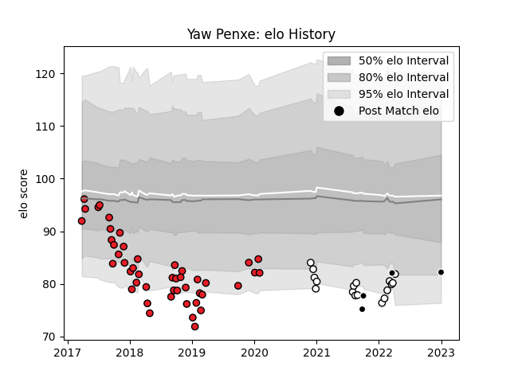

---  
layout: page  
title: Yaw Penxe  
date: 2023-02-02 18:48:28.963864  
categories: player  
---
# Yaw Penxe

## Positions: W, FB

## Current elo: 71.0

## Current Percentile: 6.0

# Elo History

# Match History

| Team           |   Appearances |   Win Rate |
|:---------------|--------------:|-----------:|
| Southern Kings |            46 |  0.0869565 |
| Natal Sharks   |            17 |  0.647059  |
| Sharks         |             6 |  0.5       |

| Opponent            |   Matches |   Win Rate |
|:--------------------|----------:|-----------:|
| Cheetahs            |         7 |   0        |
| Edinburgh           |         6 |   0.333333 |
| Connacht            |         4 |   0        |
| Ulster              |         4 |   0        |
| Griquas             |         4 |   0.75     |
| Leinster            |         4 |   0        |
| Scarlets            |         4 |   0        |
| Zebre               |         3 |   0.333333 |
| Cardiff Blues       |         3 |   0        |
| Free State Cheetahs |         3 |   0.333333 |
| Glasgow Warriors    |         3 |   0.333333 |
| Golden Lions        |         3 |   0.666667 |
| Blue Bulls          |         3 |   0.666667 |
| Munster             |         3 |   0        |
| Pumas               |         2 |   1        |
| Western Province    |         2 |   0.5      |
| Benetton Treviso    |         2 |   0        |
| Dragons             |         2 |   0        |
| Bulls               |         2 |   1        |
| Ospreys             |         1 |   0        |
| Queensland Reds     |         1 |   0        |
| Lions               |         1 |   0        |
| Western Force       |         1 |   0        |
| Jaguares            |         1 |   1        |