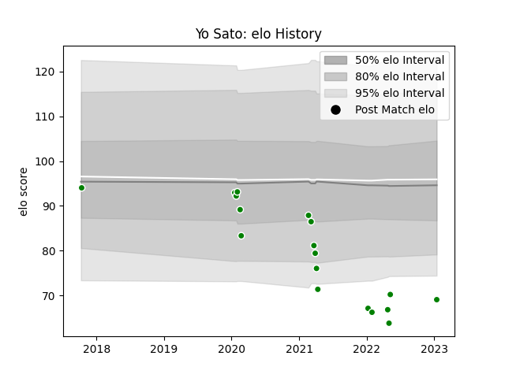

---  
layout: page  
title: Yo Sato  
date: 2023-03-21 18:41:04.108856  
categories: player  
---
# Yo Sato

Last updated: 2023-03-21
## Positions: H

## Current elo: 68.0

## Current Percentile: 5.0

# Elo History

# Match History

| Team                  |   Appearances |   Win Rate |
|:----------------------|--------------:|-----------:|
| Green Rockets Tokatsu |            29 |   0.103448 |

| Opponent                          |   Matches |   Win Rate |
|:----------------------------------|----------:|-----------:|
| Yokohama Canon Eagles             |         5 |        0   |
| Black Rams Tokyo                  |         4 |        0   |
| Saitama Wild Knights              |         3 |        0   |
| Hino Red Dolphins                 |         2 |        0   |
| Kobelco Kobe Steelers             |         2 |        0   |
| Kubota Spears Funabashi Tokyo-Bay |         2 |        0   |
| Mie Honda Heat                    |         2 |        0.5 |
| Mitsubishi Dynaboars              |         2 |        0.5 |
| Shizuoka Blue Revs                |         2 |        0   |
| Tokyo Sungoliath                  |         1 |        0   |
| Toshiba Brave Lupus Tokyo         |         1 |        0   |
| Toyota Industries Shuttles Aichi  |         1 |        1   |
| Toyota Verblitz                   |         1 |        0   |
| Urayasu D-Rocks                   |         1 |        0   |