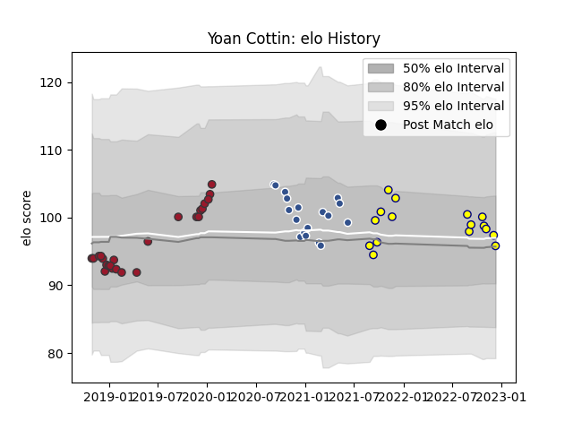

---  
layout: page  
title: Yoan Cottin  
date: 2022-12-14 11:16:58.524177  
categories: player  
---
# Yoan Cottin

## Positions: SH

## Current elo: 96.0

## Current Percentile: 63.0

# Elo History

# Match History

| Team   |   Appearances |   Win Rate |
|:-------|--------------:|-----------:|
| Toulon |            24 |   0.666667 |
| Agen   |            18 |   0        |
| Nevers |            16 |   0.59375  |

| Opponent             |   Matches |   Win Rate |
|:---------------------|----------:|-----------:|
| Castres Olympique    |         4 |   0.5      |
| Montpellier Herault  |         4 |   0.25     |
| Grenoble             |         3 |   0.333333 |
| Pau                  |         3 |   0.333333 |
| London Irish         |         3 |   0.666667 |
| Racing 92            |         3 |   0.333333 |
| Bayonne              |         3 |   0.5      |
| Brive                |         2 |   0        |
| Clermont Auvergne    |         2 |   0.5      |
| Stade Toulousain     |         2 |   0        |
| Stade Francais Paris |         2 |   0.5      |
| La Rochelle          |         2 |   0        |
| Bordeaux Begles      |         2 |   0        |
| Lyon                 |         2 |   0.5      |
| Montauban            |         2 |   0        |
| Beziers              |         2 |   0.5      |
| Scarlets             |         2 |   1        |
| Vannes               |         2 |   0.5      |
| Toulon               |         1 |   0        |
| Provence Rugby       |         1 |   1        |
| Soyaux-Angouleme     |         1 |   1        |
| Rouen                |         1 |   1        |
| Agen                 |         1 |   0        |
| Perpignan            |         1 |   1        |
| Oyonnax              |         1 |   1        |
| Newcastle Falcons    |         1 |   1        |
| Aurillac             |         1 |   1        |
| Edinburgh            |         1 |   0        |
| Colomiers            |         1 |   1        |
| Carcassonne          |         1 |   0        |
| Massy                |         1 |   1        |