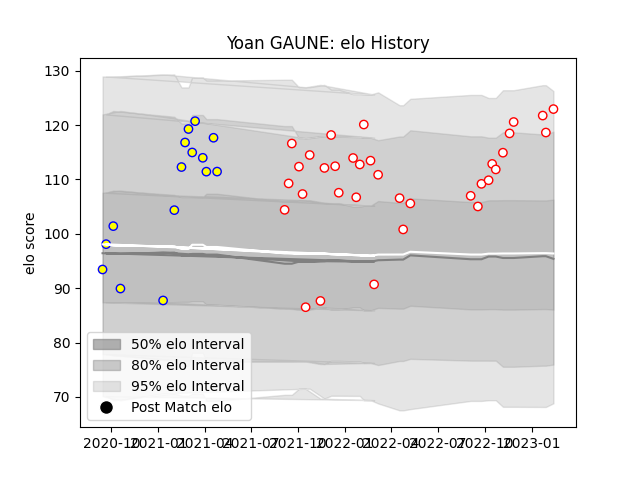

---  
layout: page  
title: Yoan GAUNE  
date: 2023-03-29 11:29:04.712421  
categories: player  
---
# Yoan GAUNE

Last updated: 2023-03-29
## Positions: L

## Current elo: 111.0

## Current Percentile: 83.0

# Elo History

# Match History

| Team    |   Appearances |   Win Rate |
|:--------|--------------:|-----------:|
| Dax     |            38 |   0.605263 |
| Aubenas |            15 |   0.366667 |

| Opponent                   |   Matches |   Win Rate |
|:---------------------------|----------:|-----------:|
| Blagnac                    |         6 |   0.5      |
| Albi                       |         5 |   0.2      |
| Bourgoin-Jallieu           |         5 |   0.6      |
| Suresnes                   |         5 |   0.8      |
| Chambery                   |         5 |   0.8      |
| Nice                       |         4 |   0.25     |
| Cognac Saint Jean d'Angély |         4 |   0.5      |
| Valence Romans Drome Rugby |         3 |   0.666667 |
| Aubenas                    |         2 |   0.5      |
| Massy                      |         2 |   0        |
| Narbonne                   |         2 |   0.5      |
| Rennes                     |         2 |   1        |
| Soyaux-Angouleme           |         2 |   0.5      |
| US Bressane                |         2 |   0.5      |
| Dijon                      |         2 |   0.75     |
| Dax                        |         1 |   0        |
| Carqueiranne-Hyères        |         1 |   1        |