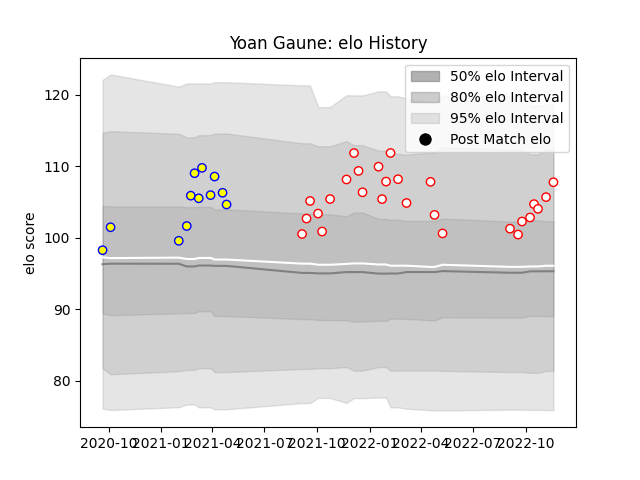

---  
layout: page  
title: Yoan Gaune  
date: 2022-11-22 11:35:21.706065  
categories: player  
---
# Yoan Gaune

## Positions: L

## Current elo: 108.0

## Current Percentile: 80.0

# Elo History

# Match History

| Team    |   Appearances |   Win Rate |
|:--------|--------------:|-----------:|
| Dax     |            27 |   0.555556 |
| Aubenas |            12 |   0.375    |

| Opponent                   |   Matches |   Win Rate |
|:---------------------------|----------:|-----------:|
| Blagnac                    |         5 |   0.6      |
| Bourgoin-Jallieu           |         4 |   0.5      |
| Suresnes                   |         4 |   0.75     |
| Albi                       |         3 |   0.333333 |
| Chambery                   |         3 |   0.666667 |
| Cognac Saint Jean d'Angély |         3 |   0.333333 |
| Nice                       |         3 |   0.333333 |
| Valence Romans Drome Rugby |         3 |   0.666667 |
| Aubenas                    |         2 |   0.5      |
| Massy                      |         2 |   0        |
| Narbonne                   |         2 |   0.5      |
| US Bressane                |         2 |   0.5      |
| Dax                        |         1 |   0        |
| Dijon                      |         1 |   0.5      |
| Rennes                     |         1 |   1        |