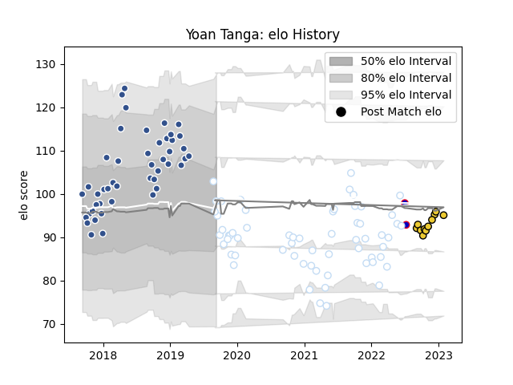

---  
layout: page  
title: Yoan Tanga  
date: 2022-12-18 16:20:15.083876  
categories: player  
---
# Yoan Tanga

## Positions: N8, FL

## Country: France

## Current elo: 104.0

## Current Percentile: 75.0

# Elo History

# Match History

| Team        |   Appearances |   Win Rate |
|:------------|--------------:|-----------:|
| Racing 92   |            59 |   0.59322  |
| Agen        |            46 |   0.380435 |
| La Rochelle |            10 |   0.7      |
| France      |             2 |   1        |

| Opponent             |   Matches |   Win Rate |
|:---------------------|----------:|-----------:|
| Stade Francais Paris |        10 |   0.7      |
| Lyon                 |        10 |   0.4      |
| Stade Toulousain     |         9 |   0.222222 |
| Clermont Auvergne    |         9 |   0.444444 |
| Toulon               |         8 |   0.625    |
| Bordeaux Begles      |         8 |   0.375    |
| Pau                  |         8 |   0.625    |
| Castres Olympique    |         7 |   0.571429 |
| La Rochelle          |         7 |   0.428571 |
| Montpellier Herault  |         6 |   0.5      |
| Brive                |         5 |   0.6      |
| Perpignan            |         4 |   0.75     |
| Bayonne              |         3 |   0        |
| Agen                 |         3 |   0.833333 |
| Ospreys              |         2 |   1        |
| Oyonnax              |         2 |   0.5      |
| Japan                |         2 |   1        |
| Grenoble             |         2 |   0.75     |
| Saracens             |         2 |   0.5      |
| Benetton Treviso     |         2 |   0.5      |
| Zebre                |         2 |   0.5      |
| Munster              |         1 |   0.5      |
| Northampton Saints   |         1 |   1        |
| Racing 92            |         1 |   0        |
| Gloucester Rugby     |         1 |   0        |
| Biarritz Olympique   |         1 |   1        |
| Ulster               |         1 |   1        |