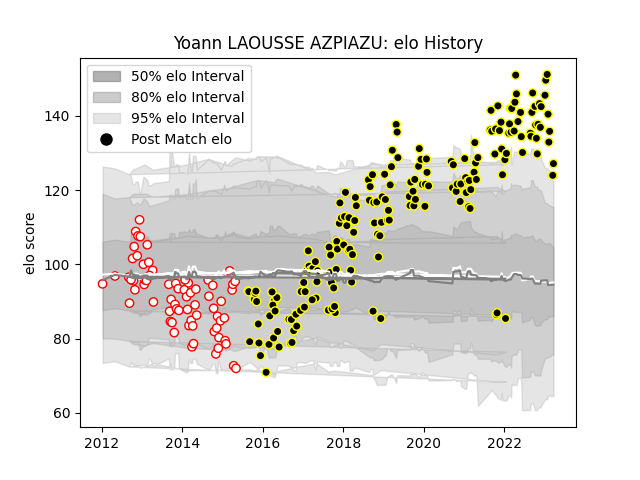

---  
layout: page  
title: Yoann LAOUSSE AZPIAZU  
date: 2023-02-05 17:57:02.595456  
categories: player  
---
# Yoann LAOUSSE AZPIAZU

## Positions: FB

## Current elo: 131.0

## Current Percentile: 96.0

# Elo History

# Match History

| Team           |   Appearances |   Win Rate |
|:---------------|--------------:|-----------:|
| Mont-de-Marsan |           177 |   0.579096 |
| Dax            |            69 |   0.362319 |

| Opponent                   |   Matches |   Win Rate |
|:---------------------------|----------:|-----------:|
| Aurillac                   |        18 |   0.722222 |
| Beziers                    |        18 |   0.722222 |
| Carcassonne                |        16 |   0.5625   |
| Colomiers                  |        16 |   0.40625  |
| Montauban                  |        14 |   0.428571 |
| Oyonnax                    |        13 |   0.423077 |
| Narbonne                   |        13 |   0.461538 |
| Perpignan                  |        12 |   0.416667 |
| Vannes                     |        10 |   0.4      |
| Biarritz Olympique         |         9 |   0.444444 |
| Provence Rugby             |         8 |   0.5      |
| Nevers                     |         8 |   0.5      |
| Massy                      |         8 |   0.5625   |
| Bayonne                    |         8 |   0.6875   |
| Albi                       |         7 |   0.571429 |
| Grenoble                   |         7 |   0.428571 |
| Soyaux-Angouleme           |         7 |   0.428571 |
| Bourgoin-Jallieu           |         6 |   0.583333 |
| US Bressane                |         6 |   0.666667 |
| Tarbes                     |         6 |   0.5      |
| Agen                       |         6 |   0.166667 |
| Rouen                      |         5 |   0.8      |
| Dax                        |         5 |   0.8      |
| Pau                        |         4 |   0.5      |
| Lyon                       |         4 |   0        |
| La Rochelle                |         4 |   0.25     |
| Auch                       |         2 |   1        |
| Brive                      |         2 |   1        |
| Mont-de-Marsan             |         2 |   0        |
| Roval Drome XV             |         1 |   0        |
| Valence Romans Drome Rugby |         1 |   1        |