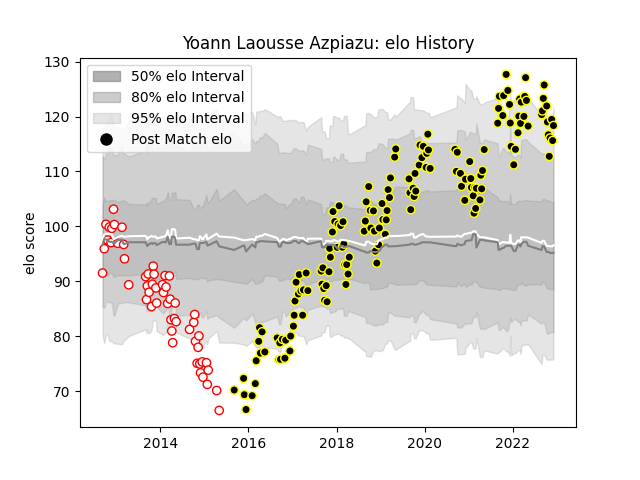

---  
layout: page  
title: Yoann Laousse Azpiazu  
date: 2022-12-12 14:51:53.844039  
categories: player  
---
# Yoann Laousse Azpiazu

## Positions: FB

## Current elo: 118.0

## Current Percentile: 92.0

# Elo History

# Match History

| Team           |   Appearances |   Win Rate |
|:---------------|--------------:|-----------:|
| Mont-de-Marsan |           149 |   0.614094 |
| Dax            |            54 |   0.361111 |

| Opponent                   |   Matches |   Win Rate |
|:---------------------------|----------:|-----------:|
| Beziers                    |        15 |   0.733333 |
| Carcassonne                |        15 |   0.6      |
| Colomiers                  |        15 |   0.433333 |
| Aurillac                   |        14 |   0.785714 |
| Montauban                  |        11 |   0.545455 |
| Oyonnax                    |        11 |   0.409091 |
| Narbonne                   |        11 |   0.545455 |
| Perpignan                  |        10 |   0.5      |
| Vannes                     |         9 |   0.444444 |
| Biarritz Olympique         |         8 |   0.5      |
| Soyaux-Angouleme           |         6 |   0.5      |
| Provence Rugby             |         6 |   0.5      |
| Agen                       |         6 |   0.166667 |
| Massy                      |         6 |   0.416667 |
| Bayonne                    |         6 |   0.75     |
| Grenoble                   |         6 |   0.333333 |
| US Bressane                |         5 |   0.8      |
| Tarbes                     |         5 |   0.6      |
| Nevers                     |         5 |   0.4      |
| Rouen                      |         5 |   0.8      |
| Albi                       |         4 |   0.5      |
| Pau                        |         4 |   0.5      |
| La Rochelle                |         3 |   0.333333 |
| Lyon                       |         3 |   0        |
| Dax                        |         3 |   1        |
| Bourgoin-Jallieu           |         3 |   0.666667 |
| Brive                      |         2 |   1        |
| Auch                       |         2 |   1        |
| Mont-de-Marsan             |         2 |   0        |
| Roval Drome XV             |         1 |   0        |
| Valence Romans Drome Rugby |         1 |   1        |