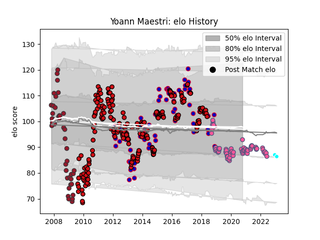

---  
layout: page  
title: Yoann Maestri  
date: 2023-02-09 13:55:00.686097  
categories: player  
---
# Yoann Maestri

## Positions: L

## Country: France

## Current elo: 93.0

## Current Percentile: 25.0

# Elo History

# Match History

| Team                             |   Appearances |   Win Rate |
|:---------------------------------|--------------:|-----------:|
| Stade Toulousain                 |           215 |   0.632558 |
| France                           |            68 |   0.397059 |
| Stade Francais Paris             |            67 |   0.440299 |
| Toulon                           |            41 |   0.585366 |
| Toyota Industries Shuttles Aichi |             2 |   0.5      |

| Opponent             |   Matches |   Win Rate |
|:---------------------|----------:|-----------:|
| Racing 92            |        25 |   0.52     |
| Clermont Auvergne    |        21 |   0.380952 |
| Toulon               |        20 |   0.45     |
| Castres Olympique    |        19 |   0.526316 |
| Montpellier Herault  |        18 |   0.638889 |
| Stade Francais Paris |        18 |   0.75     |
| Brive                |        17 |   0.470588 |
| Bayonne              |        16 |   0.53125  |
| Bordeaux Begles      |        16 |   0.625    |
| La Rochelle          |        15 |   0.533333 |
| Biarritz Olympique   |        12 |   0.75     |
| Perpignan            |        11 |   0.363636 |
| New Zealand          |        10 |   0        |
| Pau                  |         9 |   0.666667 |
| Agen                 |         9 |   1        |
| Lyon                 |         8 |   0.5      |
| England              |         8 |   0.25     |
| Ireland              |         8 |   0.25     |
| Grenoble             |         7 |   0.714286 |
| Italy                |         7 |   0.857143 |
| Stade Toulousain     |         7 |   0.428571 |
| Wales                |         6 |   0.166667 |
| Argentina            |         6 |   0.666667 |
| Oyonnax              |         6 |   0.916667 |
| Scotland             |         6 |   0.833333 |
| Australia            |         5 |   0.2      |
| South Africa         |         5 |   0        |
| Connacht             |         5 |   0.8      |
| Bourgoin-Jallieu     |         5 |   0.8      |
| Glasgow Warriors     |         4 |   1        |
| Wasps                |         4 |   0.375    |
| Montauban            |         4 |   0.75     |
| Saracens             |         3 |   0.666667 |
| Ospreys              |         3 |   0.666667 |
| Mont-de-Marsan       |         3 |   1        |
| Cardiff Blues        |         3 |   0.333333 |
| Ulster               |         2 |   0        |
| Samoa                |         2 |   1        |
| Munster              |         2 |   0        |
| Leinster             |         2 |   0.5      |
| Dragons              |         2 |   1        |
| Gloucester Rugby     |         2 |   0.5      |
| Aurillac             |         2 |   1        |
| Bath Rugby           |         2 |   0.5      |
| Benetton Treviso     |         2 |   1        |
| Beziers              |         2 |   0.5      |
| Fiji                 |         2 |   0.5      |
| Zebre                |         2 |   1        |
| Harlequins           |         2 |   0.5      |
| Albi                 |         2 |   1        |
| Leicester Tigers     |         2 |   0.5      |
| Romania              |         1 |   1        |
| Tarbes               |         1 |   1        |
| Worcester Warriors   |         1 |   0        |
| Northampton Saints   |         1 |   0        |
| Limoges              |         1 |   1        |
| Tonga                |         1 |   1        |
| Bristol Rugby        |         1 |   0        |
| Sale Sharks          |         1 |   1        |
| Canada               |         1 |   1        |
| Dax                  |         1 |   0        |
| Shimizu Blue Sharks  |         1 |   1        |
| Mie Honda Heat       |         1 |   0        |
| Edinburgh            |         1 |   0        |
| Narbonne             |         1 |   1        |