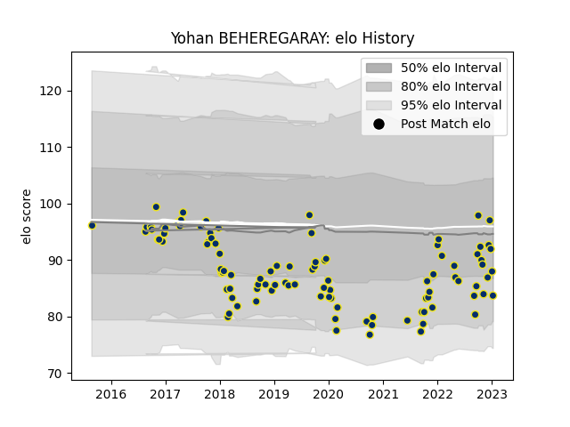

---  
layout: page  
title: Yohan BEHEREGARAY  
date: 2023-01-13 11:30:52.726123  
categories: player  
---
# Yohan BEHEREGARAY

## Positions: H

## Current elo: 84.0

## Current Percentile: 27.0

# Elo History

# Match History

| Team              |   Appearances |   Win Rate |
|:------------------|--------------:|-----------:|
| Clermont Auvergne |           100 |       0.56 |

| Opponent             |   Matches |   Win Rate |
|:---------------------|----------:|-----------:|
| Pau                  |        10 |   0.7      |
| La Rochelle          |         7 |   0.928571 |
| Stade Toulousain     |         7 |   0.142857 |
| Stade Francais Paris |         7 |   0.857143 |
| Racing 92            |         7 |   0.357143 |
| Castres Olympique    |         7 |   0.285714 |
| Montpellier Herault  |         6 |   0.666667 |
| Toulon               |         6 |   0.333333 |
| Agen                 |         5 |   0.8      |
| Bordeaux Begles      |         5 |   0.1      |
| Brive                |         5 |   0.4      |
| Lyon                 |         4 |   0.75     |
| Bayonne              |         3 |   0        |
| Perpignan            |         3 |   0.666667 |
| Dragons              |         2 |   1        |
| Grenoble             |         2 |   0.75     |
| Biarritz Olympique   |         2 |   1        |
| Ulster               |         2 |   0.5      |
| Ospreys              |         2 |   1        |
| Bath Rugby           |         2 |   1        |
| Oyonnax              |         1 |   0        |
| Northampton Saints   |         1 |   0        |
| Stormers             |         1 |   1        |
| Timisoara Saracens   |         1 |   1        |
| Leicester Tigers     |         1 |   0        |
| Harlequins           |         1 |   1        |