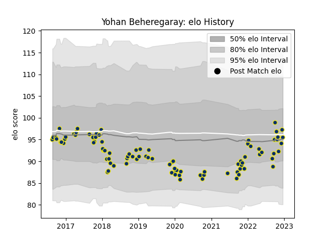

---  
layout: page  
title: Yohan Beheregaray  
date: 2022-12-09 13:23:16.670872  
categories: player  
---
# Yohan Beheregaray

## Positions: H

## Current elo: 94.0

## Current Percentile: 36.0

# Elo History

# Match History

| Team              |   Appearances |   Win Rate |
|:------------------|--------------:|-----------:|
| Clermont Auvergne |            89 |   0.561798 |

| Opponent             |   Matches |   Win Rate |
|:---------------------|----------:|-----------:|
| Pau                  |         9 |   0.777778 |
| Racing 92            |         7 |   0.357143 |
| Castres Olympique    |         7 |   0.285714 |
| Toulon               |         6 |   0.333333 |
| Stade Toulousain     |         6 |   0.166667 |
| Stade Francais Paris |         6 |   0.833333 |
| Agen                 |         5 |   0.8      |
| La Rochelle          |         5 |   0.9      |
| Montpellier Herault  |         5 |   0.6      |
| Bordeaux Begles      |         5 |   0.1      |
| Lyon                 |         4 |   0.75     |
| Brive                |         3 |   0.666667 |
| Bayonne              |         3 |   0        |
| Grenoble             |         2 |   0.75     |
| Bath Rugby           |         2 |   1        |
| Ospreys              |         2 |   1        |
| Dragons              |         2 |   1        |
| Perpignan            |         2 |   0.5      |
| Biarritz Olympique   |         2 |   1        |
| Ulster               |         2 |   0.5      |
| Harlequins           |         1 |   1        |
| Northampton Saints   |         1 |   0        |
| Oyonnax              |         1 |   0        |
| Timisoara Saracens   |         1 |   1        |