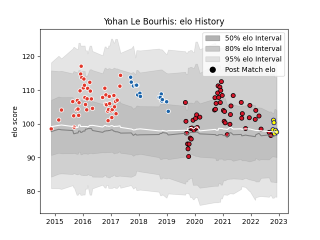

---  
layout: page  
title: Yohan Le Bourhis  
date: 2023-03-21 18:54:48.712339  
categories: player  
---
# Yohan Le Bourhis

Last updated: 2023-03-21
## Positions: FH

## Current elo: 102.0

## Current Percentile: 58.0

# Elo History

# Match History

| Team               |   Appearances |   Win Rate |
|:-------------------|--------------:|-----------:|
| Oyonnax            |            76 |   0.631579 |
| Biarritz Olympique |            70 |   0.542857 |
| Castres Olympique  |            17 |   0.411765 |
| Nevers             |             9 |   0.444444 |

| Opponent                   |   Matches |   Win Rate |
|:---------------------------|----------:|-----------:|
| Beziers                    |        12 |   0.875    |
| Carcassonne                |        11 |   0.636364 |
| Montauban                  |        11 |   0.545455 |
| Colomiers                  |        11 |   0.409091 |
| Mont-de-Marsan             |         9 |   0.555556 |
| Provence Rugby             |         9 |   0.777778 |
| Agen                       |         8 |   0.625    |
| Aurillac                   |         8 |   0.375    |
| Rouen                      |         7 |   0.571429 |
| Narbonne                   |         7 |   0.857143 |
| Vannes                     |         6 |   0.333333 |
| Grenoble                   |         6 |   0.333333 |
| Perpignan                  |         6 |   0.5      |
| Bourgoin-Jallieu           |         5 |   0.8      |
| Dax                        |         5 |   0.6      |
| Biarritz Olympique         |         5 |   0.4      |
| Nevers                     |         4 |   0.75     |
| Albi                       |         4 |   0.25     |
| Bayonne                    |         4 |   0.25     |
| Soyaux-Angouleme           |         4 |   0.75     |
| Lyon                       |         3 |   0        |
| Tarbes                     |         3 |   0.333333 |
| Racing 92                  |         3 |   0.333333 |
| Valence Romans Drome Rugby |         2 |   1        |
| US Bressane                |         2 |   1        |
| La Rochelle                |         2 |   0.5      |
| Leicester Tigers           |         2 |   0.5      |
| Pau                        |         2 |   0.5      |
| Oyonnax                    |         2 |   0.5      |
| Gloucester Rugby           |         2 |   0.5      |
| Roval Drome XV             |         1 |   1        |
| Clermont Auvergne          |         1 |   0        |
| Stade Francais Paris       |         1 |   0        |
| Stade Toulousain           |         1 |   1        |
| Munster                    |         1 |   0        |
| Massy                      |         1 |   1        |
| Exeter Chiefs              |         1 |   1        |