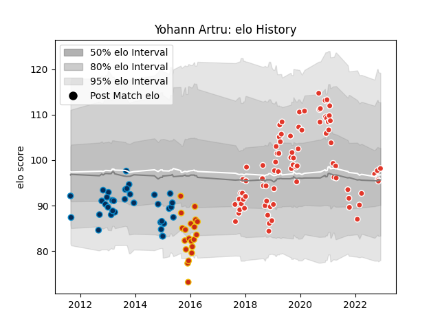

---  
layout: page  
title: Yohann Artru  
date: 2022-12-09 13:17:25.786853  
categories: player  
---
# Yohann Artru

## Positions: W

## Current elo: 98.0

## Current Percentile: 49.0

# Elo History

# Match History

| Team                |   Appearances |   Win Rate |
|:--------------------|--------------:|-----------:|
| Biarritz Olympique  |            82 |   0.536585 |
| Montpellier Herault |            35 |   0.342857 |
| Perpignan           |            20 |   0.625    |

| Opponent                   |   Matches |   Win Rate |
|:---------------------------|----------:|-----------:|
| Mont-de-Marsan             |         9 |   0.611111 |
| Colomiers                  |         8 |   0.5625   |
| Aurillac                   |         7 |   0.714286 |
| Bayonne                    |         7 |   0.714286 |
| Montauban                  |         7 |   0.285714 |
| Oyonnax                    |         6 |   0.666667 |
| Grenoble                   |         6 |   0.833333 |
| Carcassonne                |         6 |   0.666667 |
| Beziers                    |         6 |   0.5      |
| Brive                      |         5 |   0.1      |
| Perpignan                  |         5 |   0.4      |
| Nevers                     |         5 |   0.3      |
| Toulon                     |         5 |   0.3      |
| Provence Rugby             |         4 |   0.625    |
| Soyaux-Angouleme           |         4 |   0.5      |
| Lyon                       |         4 |   0.5      |
| Massy                      |         3 |   0.666667 |
| Racing 92                  |         3 |   0.166667 |
| Rouen                      |         3 |   0.666667 |
| Narbonne                   |         3 |   0.666667 |
| Vannes                     |         3 |   0.666667 |
| Biarritz Olympique         |         3 |   0.333333 |
| Clermont Auvergne          |         3 |   0        |
| Castres Olympique          |         3 |   0        |
| Dax                        |         2 |   1        |
| Bath Rugby                 |         2 |   0        |
| Bordeaux Begles            |         2 |   0.5      |
| La Rochelle                |         2 |   0        |
| Stade Toulousain           |         1 |   1        |
| Valence Romans Drome Rugby |         1 |   0        |
| US Bressane                |         1 |   0        |
| Tarbes                     |         1 |   1        |
| Leicester Tigers           |         1 |   0        |
| Benetton Treviso           |         1 |   1        |
| Sale Sharks                |         1 |   1        |
| Bourgoin-Jallieu           |         1 |   1        |
| Glasgow Warriors           |         1 |   0        |
| Montpellier Herault        |         1 |   0        |
| Agen                       |         1 |   1        |