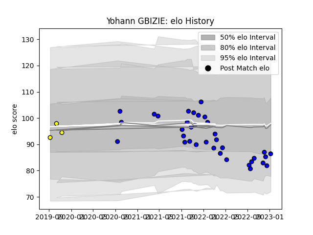

---  
layout: page  
title: Yohann GBIZIE  
date: 2023-02-09 13:55:06.280912  
categories: player  
---
# Yohann GBIZIE

## Positions: N8, FL

## Current elo: 92.0

## Current Percentile: 43.0

# Elo History

# Match History

| Team        |   Appearances |   Win Rate |
|:------------|--------------:|-----------:|
| Massy       |            40 |      0.675 |
| Carcassonne |             3 |      0     |

| Opponent                   |   Matches |   Win Rate |
|:---------------------------|----------:|-----------:|
| Soyaux-Angouleme           |         4 |   0.5      |
| Nice                       |         3 |   0.333333 |
| Aubenas                    |         3 |   1        |
| Blagnac                    |         3 |   0.666667 |
| Albi                       |         3 |   0.666667 |
| Valence Romans Drome Rugby |         2 |   1        |
| Tarbes                     |         2 |   0.5      |
| Carcassonne                |         2 |   1        |
| Chambery                   |         2 |   1        |
| Colomiers                  |         2 |   0        |
| Dax                        |         2 |   1        |
| Dijon                      |         2 |   1        |
| Mont-de-Marsan             |         2 |   0        |
| Provence Rugby             |         1 |   1        |
| Agen                       |         1 |   0        |
| Oyonnax                    |         1 |   0        |
| Suresnes                   |         1 |   1        |
| Grenoble                   |         1 |   0        |
| Nevers                     |         1 |   0        |
| Montauban                  |         1 |   1        |
| Cognac Saint Jean d'Angély |         1 |   1        |
| Bourgoin-Jallieu           |         1 |   1        |
| Aurillac                   |         1 |   0        |
| Vannes                     |         1 |   1        |