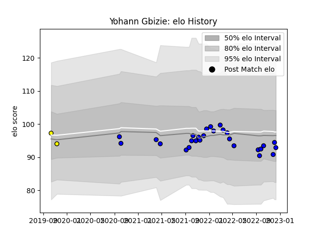

---  
layout: page  
title: Yohann Gbizie  
date: 2022-12-14 11:15:29.588839  
categories: player  
---
# Yohann Gbizie

## Positions: N8, FL

## Current elo: 93.0

## Current Percentile: 43.0

# Elo History

# Match History

| Team        |   Appearances |   Win Rate |
|:------------|--------------:|-----------:|
| Massy       |            27 |   0.666667 |
| Carcassonne |             2 |   0        |

| Opponent                   |   Matches |   Win Rate |
|:---------------------------|----------:|-----------:|
| Nice                       |         3 |   0.333333 |
| Blagnac                    |         3 |   0.666667 |
| Soyaux-Angouleme           |         3 |   0.333333 |
| Valence Romans Drome Rugby |         2 |   1        |
| Chambery                   |         2 |   1        |
| Colomiers                  |         2 |   0        |
| Aubenas                    |         2 |   1        |
| Tarbes                     |         1 |   1        |
| Suresnes                   |         1 |   1        |
| Provence Rugby             |         1 |   1        |
| Oyonnax                    |         1 |   0        |
| Agen                       |         1 |   0        |
| Nevers                     |         1 |   0        |
| Dijon                      |         1 |   1        |
| Cognac Saint Jean d'Angély |         1 |   1        |
| Carcassonne                |         1 |   1        |
| Bourgoin-Jallieu           |         1 |   1        |
| Aurillac                   |         1 |   0        |
| Dax                        |         1 |   1        |