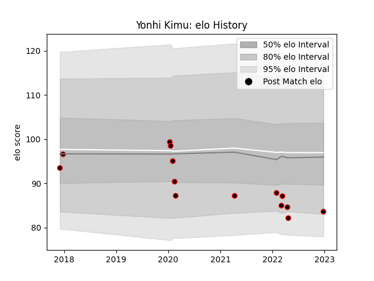

---  
layout: page  
title: Yonhi Kimu  
date: 2023-03-21 18:39:16.404519  
categories: player  
---
# Yonhi Kimu

Last updated: 2023-03-21
## Positions: C

## Current elo: 50.0

## Current Percentile: 0.0

# Elo History

# Match History

| Team                            |   Appearances |   Win Rate |
|:--------------------------------|--------------:|-----------:|
| NTT Docomo Red Hurricanes Osaka |            23 |   0.304348 |

| Opponent                         |   Matches |   Win Rate |
|:---------------------------------|----------:|-----------:|
| Saitama Wild Knights             |         2 |        0   |
| Kobelco Kobe Steelers            |         2 |        0   |
| Toyota Verblitz                  |         2 |        0   |
| Toshiba Brave Lupus Tokyo        |         2 |        0   |
| Shizuoka Blue Revs               |         2 |        0   |
| Yokohama Canon Eagles            |         2 |        0.5 |
| Kurita Water Gush                |         1 |        0   |
| Mitsubishi Dynaboars             |         1 |        1   |
| Chugoku Red Regulions            |         1 |        1   |
| Hanazono Kintetsu Liners         |         1 |        1   |
| Skyactivs Hiroshima              |         1 |        1   |
| Tokyo Sungoliath                 |         1 |        0   |
| Green Rockets Tokatsu            |         1 |        1   |
| Toyota Industries Shuttles Aichi |         1 |        1   |
| Coca-Cola Red Sparks             |         1 |        0   |
| Urayasu D-Rocks                  |         1 |        0   |
| Black Rams Tokyo                 |         1 |        0   |