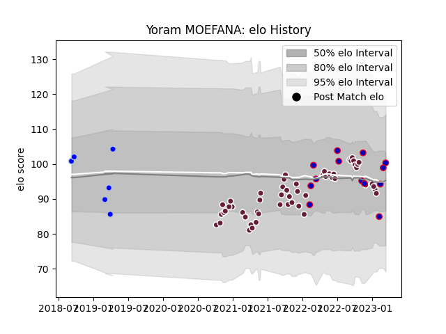

---  
layout: page  
title: Yoram MOEFANA  
date: 2023-01-31 16:07:50.337890  
categories: player  
---
# Yoram MOEFANA

## Positions: C, W

## Country: France

## Current elo: 82.0

## Current Percentile: 18.0

# Elo History

# Match History

| Team            |   Appearances |   Win Rate |
|:----------------|--------------:|-----------:|
| Bordeaux Begles |            47 |   0.574468 |
| France          |             9 |   1        |
| Colomiers       |             6 |   0.5      |

| Opponent             |   Matches |   Win Rate |
|:---------------------|----------:|-----------:|
| Montpellier Herault  |         6 |   0.666667 |
| Bayonne              |         5 |   0.6      |
| Lyon                 |         4 |   0.5      |
| Castres Olympique    |         4 |   0.875    |
| Biarritz Olympique   |         3 |   0.666667 |
| Brive                |         3 |   0.666667 |
| Stade Toulousain     |         3 |   0.333333 |
| Stade Francais Paris |         3 |   0.666667 |
| Racing 92            |         3 |   1        |
| Perpignan            |         3 |   0.333333 |
| Japan                |         3 |   1        |
| La Rochelle          |         3 |   0        |
| Pau                  |         2 |   1        |
| Agen                 |         2 |   1        |
| Carcassonne          |         2 |   0.5      |
| Australia            |         1 |   1        |
| Leicester Tigers     |         1 |   0        |
| Nevers               |         1 |   0        |
| Italy                |         1 |   1        |
| Ireland              |         1 |   1        |
| Gloucester Rugby     |         1 |   0        |
| Scarlets             |         1 |   1        |
| Scotland             |         1 |   1        |
| Sharks               |         1 |   0        |
| South Africa         |         1 |   1        |
| Clermont Auvergne    |         1 |   0.5      |
| Toulon               |         1 |   0        |
| Wales                |         1 |   1        |