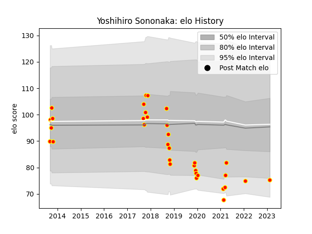

---  
layout: page  
title: Yoshihiro Sononaka  
date: 2023-02-16 11:18:36.631834  
categories: player  
---
# Yoshihiro Sononaka

## Positions: L

## Current elo: 75.0

## Current Percentile: None

# Elo History

# Match History

| Team          |   Appearances |   Win Rate |
|:--------------|--------------:|-----------:|
| Kyuden Voltex |            33 |   0.333333 |

| Opponent                         |   Matches |   Win Rate |
|:---------------------------------|----------:|-----------:|
| Kurita Water Gush                |         4 |   0.25     |
| Toyota Industries Shuttles Aichi |         3 |   0        |
| Kamaishi Seawaves                |         3 |   0.666667 |
| Chugoku Red Regulions            |         3 |   1        |
| Mazda Blue Zoomers               |         2 |   0.5      |
| Shimizu Blue Sharks              |         2 |   1        |
| Coca-Cola Red Sparks             |         2 |   0        |
| Hanazono Kintetsu Liners         |         2 |   0        |
| Mitsubishi Dynaboars             |         2 |   0        |
| Toyota Verblitz                  |         1 |   0        |
| Tokyo Sungoliath                 |         1 |   0        |
| Skyactivs Hiroshima              |         1 |   1        |
| Chubu Electric Power             |         1 |   1        |
| NTT Docomo Red Hurricanes Osaka  |         1 |   0        |
| Mie Honda Heat                   |         1 |   0        |
| Kobelco Kobe Steelers            |         1 |   0        |
| Hino Red Dolphins                |         1 |   0        |
| Green Rockets Tokatsu            |         1 |   0        |
| Urayasu D-Rocks                  |         1 |   0        |