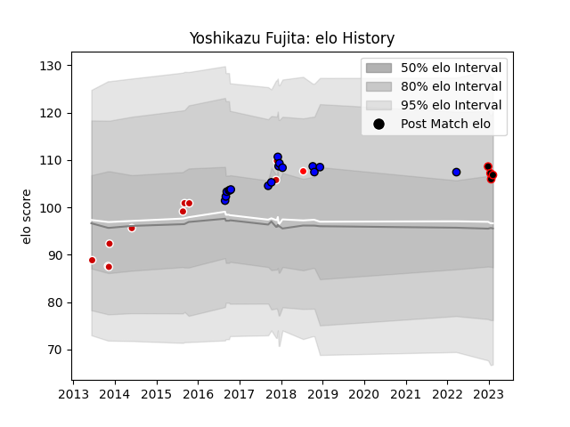

---  
layout: page  
title: Yoshikazu Fujita  
date: 2023-02-09 13:57:26.665214  
categories: player  
---
# Yoshikazu Fujita

## Positions: W, FB

## Country: Japan

## Current elo: 107.0

## Current Percentile: 74.0

# Elo History

# Match History

| Team                 |   Appearances |   Win Rate |
|:---------------------|--------------:|-----------:|
| Saitama Wild Knights |            16 |      0.875 |
| Japan                |            10 |      0.65  |
| Mie Honda Heat       |             4 |      1     |
| Sunwolves            |             1 |      0     |

| Opponent                         |   Matches |   Win Rate |
|:---------------------------------|----------:|-----------:|
| Black Rams Tokyo                 |         3 |        1   |
| Green Rockets Tokatsu            |         2 |        1   |
| Toyota Industries Shuttles Aichi |         2 |        1   |
| Coca-Cola Red Sparks             |         2 |        1   |
| Samoa                            |         1 |        1   |
| Wales                            |         1 |        0   |
| Uruguay                          |         1 |        1   |
| Urayasu D-Rocks                  |         1 |        1   |
| United States of America         |         1 |        1   |
| Tonga                            |         1 |        1   |
| Tokyo Sungoliath                 |         1 |        0   |
| Shizuoka Blue Revs               |         1 |        0   |
| Shimizu Blue Sharks              |         1 |        1   |
| Scotland                         |         1 |        0   |
| Russia                           |         1 |        1   |
| Queensland Reds                  |         1 |        0   |
| New Zealand                      |         1 |        0   |
| Munakata Sanix Blues             |         1 |        1   |
| Mie Honda Heat                   |         1 |        1   |
| Kobelco Kobe Steelers            |         1 |        1   |
| Kamaishi Seawaves                |         1 |        1   |
| Hino Red Dolphins                |         1 |        1   |
| Hanazono Kintetsu Liners         |         1 |        1   |
| Georgia                          |         1 |        1   |
| France                           |         1 |        0.5 |
| Yokohama Canon Eagles            |         1 |        1   |