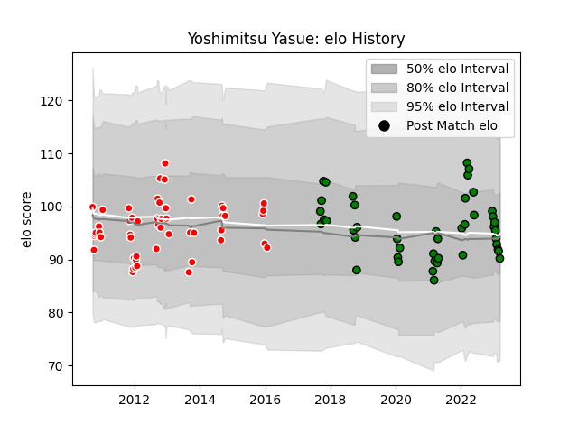

---  
layout: page  
title: Yoshimitsu Yasue  
date: 2022-12-18 16:29:47.551730  
categories: player  
---
# Yoshimitsu Yasue

## Positions: H, P

## Current elo: 115.0

## Current Percentile: 94.0

# Elo History

# Match History

| Team                  |   Appearances |   Win Rate |
|:----------------------|--------------:|-----------:|
| Mitsubishi Dynaboars  |            23 |   0.695652 |
| Kobelco Kobe Steelers |            19 |   0.710526 |

| Opponent                         |   Matches |   Win Rate |
|:---------------------------------|----------:|-----------:|
| Hanazono Kintetsu Liners         |         5 |   0.6      |
| NTT Docomo Red Hurricanes Osaka  |         4 |   0.25     |
| Coca-Cola Red Sparks             |         3 |   1        |
| Hino Red Dolphins                |         3 |   0.666667 |
| Black Rams Tokyo                 |         2 |   1        |
| Kyuden Voltex                    |         2 |   1        |
| Toyota Verblitz                  |         2 |   0.25     |
| Mie Honda Heat                   |         2 |   0.5      |
| Kamaishi Seawaves                |         2 |   1        |
| Green Rockets Tokatsu            |         2 |   1        |
| Chugoku Red Regulions            |         2 |   1        |
| Yokohama Canon Eagles            |         2 |   0.5      |
| Kurita Water Gush                |         1 |   1        |
| Mazda Blue Zoomers               |         1 |   1        |
| Chubu Electric Power             |         1 |   1        |
| Munakata Sanix Blues             |         1 |   1        |
| Saitama Wild Knights             |         1 |   0        |
| Shizuoka Blue Revs               |         1 |   1        |
| Skyactivs Hiroshima              |         1 |   1        |
| Tokyo Sungoliath                 |         1 |   0        |
| Toshiba Brave Lupus Tokyo        |         1 |   0        |
| Toyota Industries Shuttles Aichi |         1 |   1        |
| Urayasu D-Rocks                  |         1 |   1        |