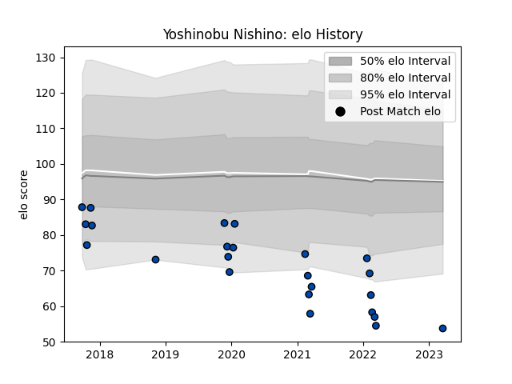

---  
layout: page  
title: Yoshinobu Nishino  
date: 2023-03-21 18:26:01.012988  
categories: player  
---
# Yoshinobu Nishino

Last updated: 2023-03-21
## Positions: L

## Current elo: 54.0

## Current Percentile: None

# Elo History

# Match History

| Team                |   Appearances |   Win Rate |
|:--------------------|--------------:|-----------:|
| Mazda Blue Zoomers  |            12 |  0.375     |
| Skyactivs Hiroshima |            12 |  0.0833333 |

| Opponent                         |   Matches |   Win Rate |
|:---------------------------------|----------:|-----------:|
| Kamaishi Seawaves                |         4 |   0.125    |
| Chugoku Red Regulions            |         3 |   0.666667 |
| Hanazono Kintetsu Liners         |         3 |   0        |
| Kyuden Voltex                    |         3 |   0.333333 |
| Coca-Cola Red Sparks             |         2 |   0        |
| Mie Honda Heat                   |         2 |   0        |
| Chubu Electric Power             |         1 |   1        |
| Hino Red Dolphins                |         1 |   0        |
| Kurita Water Gush                |         1 |   0        |
| Mitsubishi Dynaboars             |         1 |   0        |
| NTT Docomo Red Hurricanes Osaka  |         1 |   0        |
| Shimizu Blue Sharks              |         1 |   1        |
| Toyota Industries Shuttles Aichi |         1 |   0        |