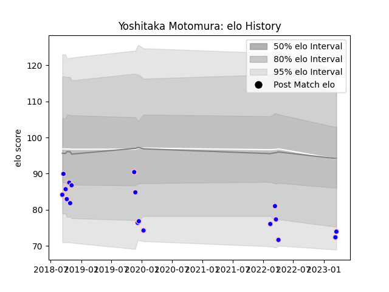

---  
layout: page  
title: Yoshitaka Motomura  
date: 2023-03-21 18:46:45.944880  
categories: player  
---
# Yoshitaka Motomura

Last updated: 2023-03-21
## Positions: SH

## Current elo: 74.0

## Current Percentile: 5.0

# Elo History

# Match History

| Team              |   Appearances |   Win Rate |
|:------------------|--------------:|-----------:|
| Kurita Water Gush |            18 |   0.444444 |

| Opponent                         |   Matches |   Win Rate |
|:---------------------------------|----------:|-----------:|
| Chugoku Red Regulions            |         3 |   0.666667 |
| Kyuden Voltex                    |         3 |   0.666667 |
| Kamaishi Seawaves                |         2 |   0.5      |
| Mazda Blue Zoomers               |         2 |   1        |
| NTT Docomo Red Hurricanes Osaka  |         2 |   0        |
| Coca-Cola Red Sparks             |         1 |   0        |
| Hanazono Kintetsu Liners         |         1 |   0        |
| Mitsubishi Dynaboars             |         1 |   0        |
| Munakata Sanix Blues             |         1 |   0        |
| Shimizu Blue Sharks              |         1 |   1        |
| Toyota Industries Shuttles Aichi |         1 |   0        |