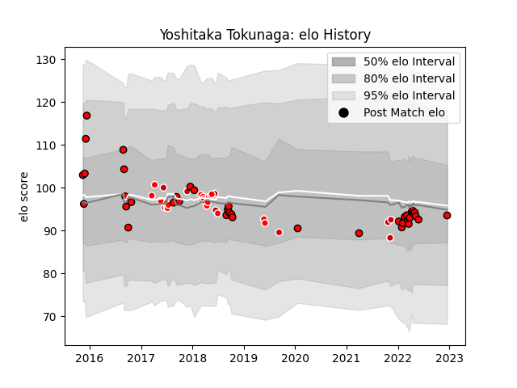

---  
layout: page  
title: Yoshitaka Tokunaga  
date: 2023-03-17 17:20:51.571951  
categories: player  
---
# Yoshitaka Tokunaga

## Positions: N8, FL

## Country: Japan

## Current elo: 94.0

## Current Percentile: 41.0

# Elo History

# Match History

| Team                      |   Appearances |   Win Rate |
|:--------------------------|--------------:|-----------:|
| Toshiba Brave Lupus Tokyo |            39 |   0.551282 |
| Sunwolves                 |            19 |   0.263158 |
| Japan                     |            10 |   0.35     |

| Opponent                          |   Matches |   Win Rate |
|:----------------------------------|----------:|-----------:|
| Kubota Spears Funabashi Tokyo-Bay |         5 |   0.4      |
| Shizuoka Blue Revs                |         4 |   0.5      |
| Saitama Wild Knights              |         4 |   0.125    |
| Black Rams Tokyo                  |         4 |   0.75     |
| Yokohama Canon Eagles             |         3 |   0.666667 |
| Toyota Verblitz                   |         3 |   0.333333 |
| Bulls                             |         3 |   0.666667 |
| Green Rockets Tokatsu             |         3 |   1        |
| Ireland                           |         3 |   0        |
| Urayasu D-Rocks                   |         2 |   0        |
| Tokyo Sungoliath                  |         2 |   0.5      |
| Stormers                          |         2 |   0.5      |
| Sharks                            |         2 |   0        |
| NTT Docomo Red Hurricanes Osaka   |         2 |   1        |
| Lions                             |         2 |   0        |
| Melbourne Rebels                  |         2 |   0        |
| Kobelco Kobe Steelers             |         2 |   0.5      |
| Blues                             |         2 |   0.5      |
| Italy                             |         2 |   0.5      |
| France                            |         1 |   0.5      |
| Brumbies                          |         1 |   0        |
| Toyota Industries Shuttles Aichi  |         1 |   1        |
| Chiefs                            |         1 |   0        |
| Coca-Cola Red Sparks              |         1 |   1        |
| South Africa                      |         1 |   0        |
| Crusaders                         |         1 |   0        |
| Hanazono Kintetsu Liners          |         1 |   1        |
| Romania                           |         1 |   1        |
| Queensland Reds                   |         1 |   1        |
| Portugal                          |         1 |   1        |
| New South Wales Waratahs          |         1 |   0        |
| Hurricanes                        |         1 |   0        |
| Munakata Sanix Blues              |         1 |   0        |
| Mie Honda Heat                    |         1 |   1        |
| Australia                         |         1 |   0        |