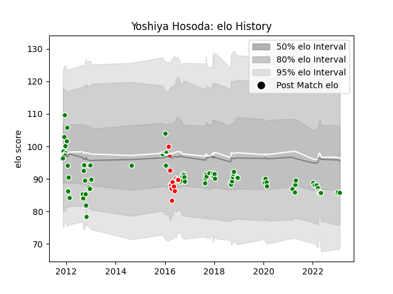

---  
layout: page  
title: Yoshiya Hosoda  
date: 2023-02-09 13:57:31.661813  
categories: player  
---
# Yoshiya Hosoda

## Positions: FL, L

## Country: Japan

## Current elo: 86.0

## Current Percentile: 24.0

# Elo History

# Match History

| Team                  |   Appearances |   Win Rate |
|:----------------------|--------------:|-----------:|
| Green Rockets Tokatsu |            77 |   0.344156 |
| Sunwolves             |            14 |   0.107143 |
| Japan                 |             1 |   1        |

| Opponent                          |   Matches |   Win Rate |
|:----------------------------------|----------:|-----------:|
| Tokyo Sungoliath                  |         9 |   0        |
| Black Rams Tokyo                  |         6 |   0.166667 |
| NTT Docomo Red Hurricanes Osaka   |         5 |   0.4      |
| Toyota Verblitz                   |         5 |   0.4      |
| Toshiba Brave Lupus Tokyo         |         5 |   0.2      |
| Shizuoka Blue Revs                |         5 |   0.2      |
| Saitama Wild Knights              |         5 |   0        |
| Kobelco Kobe Steelers             |         5 |   0        |
| Kubota Spears Funabashi Tokyo-Bay |         5 |   0.3      |
| Urayasu D-Rocks                   |         4 |   0.75     |
| Toyota Industries Shuttles Aichi  |         4 |   0.75     |
| Yokohama Canon Eagles             |         4 |   0.5      |
| Munakata Sanix Blues              |         3 |   0.666667 |
| Coca-Cola Red Sparks              |         3 |   1        |
| Hanazono Kintetsu Liners          |         3 |   0.666667 |
| Hino Red Dolphins                 |         2 |   0.5      |
| Stormers                          |         2 |   0.25     |
| Mie Honda Heat                    |         2 |   0.5      |
| Bulls                             |         2 |   0        |
| Cheetahs                          |         2 |   0        |
| Western Force                     |         1 |   0        |
| Canada                            |         1 |   1        |
| Lions                             |         1 |   0        |
| Southern Kings                    |         1 |   0        |
| Melbourne Rebels                  |         1 |   0        |
| Sharks                            |         1 |   0        |
| Jaguares                          |         1 |   1        |
| New South Wales Waratahs          |         1 |   0        |
| Kyuden Voltex                     |         1 |   1        |
| Brumbies                          |         1 |   0        |
| Mitsubishi Dynaboars              |         1 |   0        |