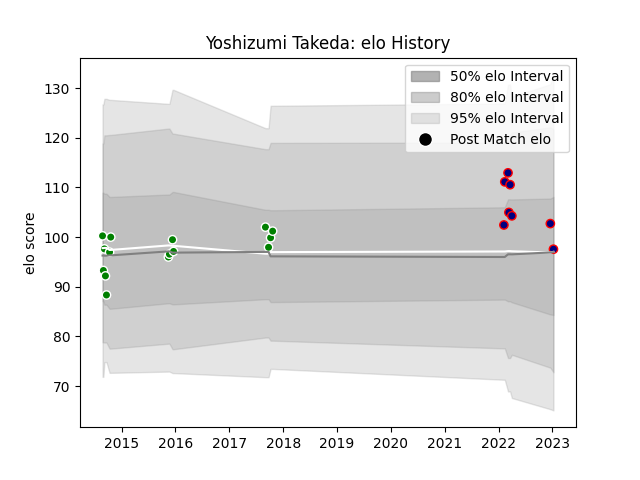

---  
layout: page  
title: Yoshizumi Takeda  
date: 2023-03-17 17:16:16.991553  
categories: player  
---
# Yoshizumi Takeda

## Positions: FB

## Current elo: 105.0

## Current Percentile: 79.0

# Elo History

# Match History

| Team                     |   Appearances |   Win Rate |
|:-------------------------|--------------:|-----------:|
| Toyota Verblitz          |            15 |   0.633333 |
| Hanazono Kintetsu Liners |             9 |   0.777778 |
| Sunwolves                |             2 |   0        |

| Opponent                         |   Matches |   Win Rate |
|:---------------------------------|----------:|-----------:|
| Yokohama Canon Eagles            |         3 |   0.666667 |
| Coca-Cola Red Sparks             |         3 |   1        |
| Hino Red Dolphins                |         2 |   1        |
| Toyota Industries Shuttles Aichi |         2 |   0.5      |
| Skyactivs Hiroshima              |         2 |   1        |
| Black Rams Tokyo                 |         2 |   1        |
| Hanazono Kintetsu Liners         |         1 |   0        |
| Kobelco Kobe Steelers            |         1 |   0.5      |
| Mie Honda Heat                   |         1 |   1        |
| Brumbies                         |         1 |   0        |
| Munakata Sanix Blues             |         1 |   1        |
| NTT Docomo Red Hurricanes Osaka  |         1 |   1        |
| Saitama Wild Knights             |         1 |   0        |
| Shizuoka Blue Revs               |         1 |   0        |
| Green Rockets Tokatsu            |         1 |   1        |
| Tokyo Sungoliath                 |         1 |   0        |
| Crusaders                        |         1 |   0        |
| Mitsubishi Dynaboars             |         1 |   0        |