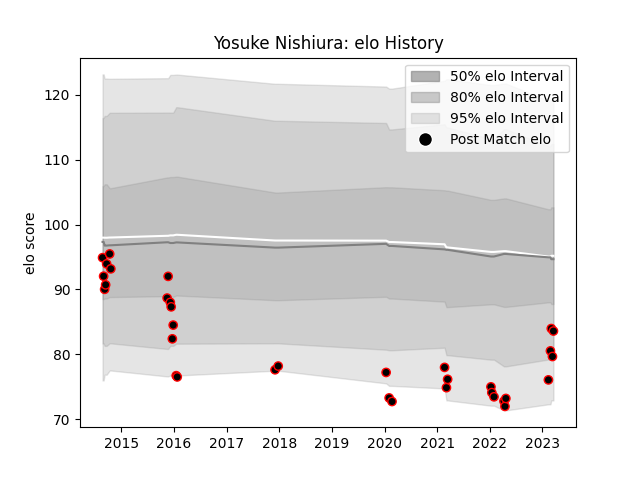

---  
layout: page  
title: Yosuke Nishiura  
date: 2023-03-21 18:12:16.134523  
categories: player  
---
# Yosuke Nishiura

Last updated: 2023-03-21
## Positions: P

## Current elo: 84.0

## Current Percentile: 10.0

# Elo History

# Match History

| Team                            |   Appearances |   Win Rate |
|:--------------------------------|--------------:|-----------:|
| NTT Docomo Red Hurricanes Osaka |            34 |   0.308824 |

| Opponent                         |   Matches |   Win Rate |
|:---------------------------------|----------:|-----------:|
| Black Rams Tokyo                 |         4 |   0.25     |
| Green Rockets Tokatsu            |         3 |   0.5      |
| Toyota Verblitz                  |         3 |   0        |
| Yokohama Canon Eagles            |         3 |   0.333333 |
| Coca-Cola Red Sparks             |         3 |   0.333333 |
| Kobelco Kobe Steelers            |         2 |   0        |
| Saitama Wild Knights             |         2 |   0        |
| Shizuoka Blue Revs               |         2 |   0        |
| Skyactivs Hiroshima              |         2 |   1        |
| Tokyo Sungoliath                 |         2 |   0        |
| Toshiba Brave Lupus Tokyo        |         2 |   0        |
| Hanazono Kintetsu Liners         |         1 |   0        |
| Kurita Water Gush                |         1 |   1        |
| Kyuden Voltex                    |         1 |   1        |
| Chugoku Red Regulions            |         1 |   1        |
| Toyota Industries Shuttles Aichi |         1 |   0        |
| Mitsubishi Dynaboars             |         1 |   1        |