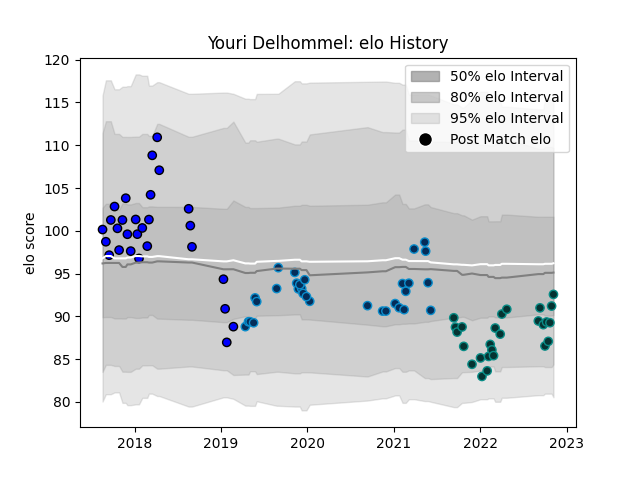

---  
layout: page  
title: Youri Delhommel  
date: 2023-02-02 18:50:51.445194  
categories: player  
---
# Youri Delhommel

## Positions: H

## Current elo: 108.0

## Current Percentile: 4.0

# Elo History

# Match History

| Team                |   Appearances |   Win Rate |
|:--------------------|--------------:|-----------:|
| Pau                 |            35 |   0.371429 |
| Massy               |            34 |   0.426471 |
| Montpellier Herault |            34 |   0.411765 |

| Opponent             |   Matches |   Win Rate |
|:---------------------|----------:|-----------:|
| Lyon                 |         8 |   0.25     |
| Stade Francais Paris |         7 |   0.357143 |
| Clermont Auvergne    |         6 |   0.5      |
| Bordeaux Begles      |         5 |   0.4      |
| Stade Toulousain     |         5 |   0.6      |
| Bayonne              |         5 |   0        |
| Racing 92            |         5 |   0        |
| Toulon               |         4 |   0.375    |
| Perpignan            |         4 |   0.75     |
| Brive                |         4 |   0.5      |
| Biarritz Olympique   |         4 |   0.5      |
| Montpellier Herault  |         3 |   0.333333 |
| Aurillac             |         3 |   0.333333 |
| Nevers               |         3 |   0.333333 |
| Colomiers            |         3 |   0.666667 |
| Soyaux-Angouleme     |         3 |   0.5      |
| Castres Olympique    |         3 |   0.333333 |
| La Rochelle          |         3 |   0.333333 |
| Pau                  |         2 |   0.5      |
| Mont-de-Marsan       |         2 |   0.5      |
| Vannes               |         2 |   0.5      |
| Grenoble             |         2 |   1        |
| Gloucester Rugby     |         2 |   0.5      |
| Dragons              |         2 |   0.5      |
| Carcassonne          |         2 |   1        |
| Beziers              |         2 |   0        |
| Montauban            |         1 |   0        |
| London Irish         |         1 |   0        |
| Narbonne             |         1 |   1        |
| Provence Rugby       |         1 |   0        |
| Dax                  |         1 |   1        |
| Connacht             |         1 |   0        |
| Cheetahs             |         1 |   0        |
| US Bressane          |         1 |   0        |
| Agen                 |         1 |   1        |