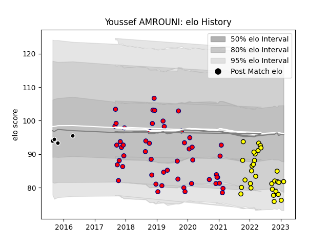

---  
layout: page  
title: Youssef AMROUNI  
date: 2023-02-04 18:30:11.324582  
categories: player  
---
# Youssef AMROUNI

## Positions: P

## Current elo: 82.0

## Current Percentile: 7.0

# Elo History

# Match History

| Team           |   Appearances |   Win Rate |
|:---------------|--------------:|-----------:|
| Aurillac       |            52 |   0.432692 |
| Carcassonne    |            30 |   0.466667 |
| Provence Rugby |             4 |   0.75     |

| Opponent                   |   Matches |   Win Rate |
|:---------------------------|----------:|-----------:|
| Vannes                     |         6 |   0.333333 |
| Beziers                    |         6 |   0.333333 |
| Provence Rugby             |         6 |   0.166667 |
| Oyonnax                    |         5 |   0.4      |
| Soyaux-Angouleme           |         5 |   0.2      |
| Rouen                      |         5 |   0.8      |
| Grenoble                   |         5 |   0.4      |
| Montauban                  |         5 |   0.7      |
| US Bressane                |         4 |   0.75     |
| Biarritz Olympique         |         4 |   0.5      |
| Colomiers                  |         4 |   0.25     |
| Massy                      |         4 |   0.25     |
| Narbonne                   |         4 |   0.75     |
| Perpignan                  |         3 |   0.333333 |
| Mont-de-Marsan             |         3 |   0.333333 |
| Nevers                     |         3 |   0.333333 |
| Aurillac                   |         3 |   0.666667 |
| Carcassonne                |         3 |   0.666667 |
| Bayonne                    |         3 |   0.666667 |
| Agen                       |         2 |   0.5      |
| Dax                        |         1 |   0        |
| Bourgoin-Jallieu           |         1 |   1        |
| Valence Romans Drome Rugby |         1 |   1        |