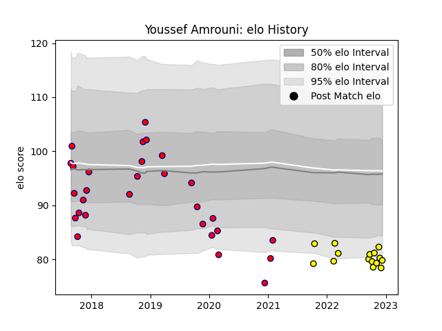

---  
layout: page  
title: Youssef Amrouni  
date: 2022-11-22 11:42:18.511165  
categories: player  
---
# Youssef Amrouni

## Positions: P

## Current elo: 83.0

## Current Percentile: 4.0

# Elo History

# Match History

| Team        |   Appearances |   Win Rate |
|:------------|--------------:|-----------:|
| Aurillac    |            29 |   0.431034 |
| Carcassonne |            12 |   0.25     |

| Opponent           |   Matches |   Win Rate |
|:-------------------|----------:|-----------:|
| Provence Rugby     |         4 |   0        |
| Soyaux-Angouleme   |         4 |   0        |
| Vannes             |         3 |   0.333333 |
| Biarritz Olympique |         3 |   0.333333 |
| Grenoble           |         3 |   0.333333 |
| Massy              |         3 |   0.333333 |
| US Bressane        |         2 |   0.5      |
| Beziers            |         2 |   0.5      |
| Colomiers          |         2 |   0        |
| Aurillac           |         2 |   0.5      |
| Rouen              |         2 |   1        |
| Narbonne           |         2 |   1        |
| Oyonnax            |         2 |   0.5      |
| Perpignan          |         2 |   0.5      |
| Agen               |         1 |   0        |
| Montauban          |         1 |   0.5      |
| Carcassonne        |         1 |   1        |
| Bayonne            |         1 |   0        |
| Mont-de-Marsan     |         1 |   1        |