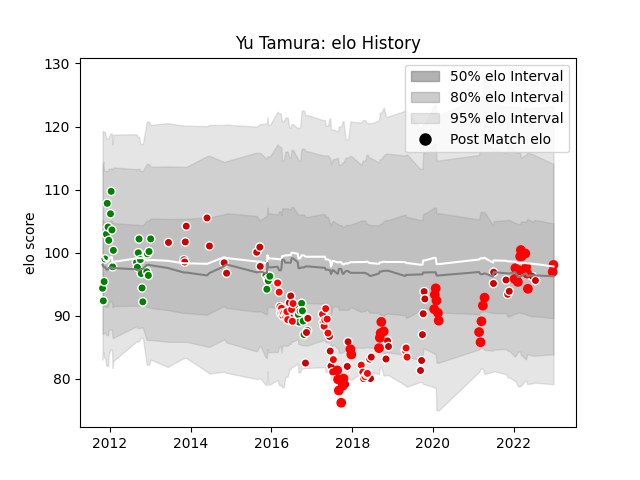

---  
layout: page  
title: Yu Tamura  
date: 2023-03-17 17:05:51.482047  
categories: player  
---
# Yu Tamura

## Positions: FH, C

## Country: Japan

## Current elo: 91.0

## Current Percentile: 32.0

# Elo History

# Match History

| Team                      |   Appearances |   Win Rate |
|:--------------------------|--------------:|-----------:|
| Green Rockets Tokatsu     |            56 |   0.455357 |
| Japan                     |            44 |   0.420455 |
| Yokohama Canon Eagles     |            43 |   0.453488 |
| Sunwolves                 |            33 |   0.166667 |
| Tokyo Sungoliath          |            24 |   0.666667 |
| Toshiba Brave Lupus Tokyo |             8 |   0.5      |

| Opponent                          |   Matches |   Win Rate |
|:----------------------------------|----------:|-----------:|
| Kobelco Kobe Steelers             |        12 |   0.25     |
| Saitama Wild Knights              |        12 |   0        |
| Black Rams Tokyo                  |        11 |   0.454545 |
| Urayasu D-Rocks                   |        11 |   0.727273 |
| Toshiba Brave Lupus Tokyo         |        11 |   0.363636 |
| Shizuoka Blue Revs                |        10 |   0.4      |
| Green Rockets Tokatsu             |         7 |   0.857143 |
| Kubota Spears Funabashi Tokyo-Bay |         7 |   0.642857 |
| Toyota Verblitz                   |         7 |   0.571429 |
| NTT Docomo Red Hurricanes Osaka   |         7 |   0.714286 |
| Toyota Industries Shuttles Aichi  |         6 |   0.666667 |
| Tokyo Sungoliath                  |         6 |   0.166667 |
| Scotland                          |         6 |   0.166667 |
| Munakata Sanix Blues              |         6 |   0.666667 |
| Mie Honda Heat                    |         5 |   0.5      |
| Ireland                           |         5 |   0.2      |
| Stormers                          |         4 |   0.375    |
| Yokohama Canon Eagles             |         4 |   0.75     |
| Russia                            |         3 |   1        |
| Queensland Reds                   |         3 |   0.333333 |
| Hanazono Kintetsu Liners          |         3 |   0.333333 |
| Italy                             |         3 |   0.666667 |
| Georgia                           |         3 |   0.666667 |
| Bulls                             |         3 |   0.333333 |
| Cheetahs                          |         3 |   0        |
| South Africa                      |         3 |   0.333333 |
| Wales                             |         2 |   0        |
| Uruguay                           |         2 |   1        |
| Blues                             |         2 |   0.5      |
| Brumbies                          |         2 |   0        |
| Chiefs                            |         2 |   0        |
| Sharks                            |         2 |   0        |
| Coca-Cola Red Sparks              |         2 |   1        |
| Samoa                             |         2 |   1        |
| Highlanders                       |         2 |   0        |
| Jaguares                          |         2 |   0.5      |
| New South Wales Waratahs          |         2 |   0        |
| France                            |         2 |   0.25     |
| Kyuden Voltex                     |         2 |   1        |
| Australia                         |         2 |   0        |
| New Zealand                       |         2 |   0        |
| New Zealand Maori                 |         1 |   0        |
| Canada                            |         1 |   1        |
| Western Force                     |         1 |   0        |
| Hurricanes                        |         1 |   0        |
| British and Irish Lions           |         1 |   0        |
| Lions                             |         1 |   0        |
| Tonga                             |         1 |   1        |
| Spain                             |         1 |   1        |
| Melbourne Rebels                  |         1 |   0        |
| Southern Kings                    |         1 |   0        |
| Mitsubishi Dynaboars              |         1 |   1        |
| Fiji                              |         1 |   0        |
| England                           |         1 |   0        |
| Crusaders                         |         1 |   0        |
| Hino Red Dolphins                 |         1 |   1        |
| Romania                           |         1 |   1        |
| Argentina                         |         1 |   0        |