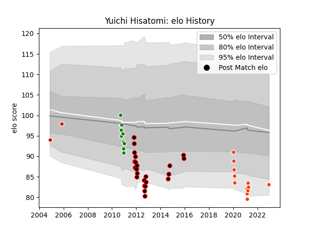

---  
layout: page  
title: Yuichi Hisatomi  
date: 2022-12-18 16:39:32.844652  
categories: player  
---
# Yuichi Hisatomi

## Positions: P

## Country: Japan

## Current elo: 83.0

## Current Percentile: None

# Elo History

# Match History

| Team                            |   Appearances |   Win Rate |
|:--------------------------------|--------------:|-----------:|
| NTT Docomo Red Hurricanes Osaka |            23 |   0.152174 |
| Hino Red Dolphins               |            12 |   0.25     |
| Green Rockets Tokatsu           |            10 |   0.5      |
| Japan                           |             2 |   0.5      |

| Opponent                          |   Matches |   Win Rate |
|:----------------------------------|----------:|-----------:|
| Kobelco Kobe Steelers             |         6 |   0.333333 |
| Black Rams Tokyo                  |         4 |   0.25     |
| Shizuoka Blue Revs                |         4 |   0        |
| Green Rockets Tokatsu             |         4 |   0.75     |
| Urayasu D-Rocks                   |         3 |   0        |
| Toyota Verblitz                   |         3 |   0        |
| Toshiba Brave Lupus Tokyo         |         3 |   0        |
| Tokyo Sungoliath                  |         3 |   0.333333 |
| Saitama Wild Knights              |         3 |   0        |
| Hanazono Kintetsu Liners          |         2 |   0.5      |
| Munakata Sanix Blues              |         2 |   0.5      |
| Coca-Cola Red Sparks              |         2 |   0.5      |
| Spain                             |         1 |   1        |
| NTT Docomo Red Hurricanes Osaka   |         1 |   0        |
| Scotland                          |         1 |   0        |
| Mie Honda Heat                    |         1 |   0.5      |
| Kyuden Voltex                     |         1 |   0        |
| Kubota Spears Funabashi Tokyo-Bay |         1 |   0        |
| Kamaishi Seawaves                 |         1 |   1        |
| Yokohama Canon Eagles             |         1 |   0        |