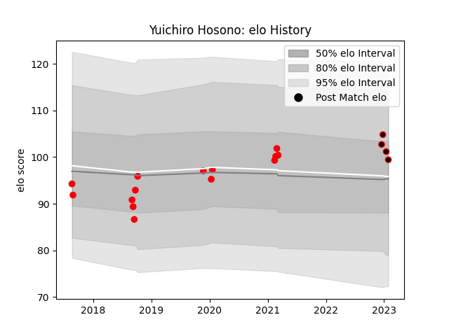

---  
layout: page  
title: Yuichiro Hosono  
date: 2022-12-28 12:57:34.080766  
categories: player  
---
# Yuichiro Hosono

## Positions: P

## Current elo: 99.0

## Current Percentile: None

# Elo History

# Match History

| Team                            |   Appearances |   Win Rate |
|:--------------------------------|--------------:|-----------:|
| Coca-Cola Red Sparks            |            14 |   0.428571 |
| NTT Docomo Red Hurricanes Osaka |             2 |   1        |

| Opponent                         |   Matches |   Win Rate |
|:---------------------------------|----------:|-----------:|
| Kyuden Voltex                    |         3 |        1   |
| Chugoku Red Regulions            |         2 |        1   |
| Toyota Industries Shuttles Aichi |         2 |        0.5 |
| Black Rams Tokyo                 |         1 |        0   |
| Green Rockets Tokatsu            |         1 |        0   |
| Kurita Water Gush                |         1 |        1   |
| Munakata Sanix Blues             |         1 |        0   |
| Saitama Wild Knights             |         1 |        0   |
| Shizuoka Blue Revs               |         1 |        0   |
| Skyactivs Hiroshima              |         1 |        1   |
| Toshiba Brave Lupus Tokyo        |         1 |        0   |
| Yokohama Canon Eagles            |         1 |        0   |