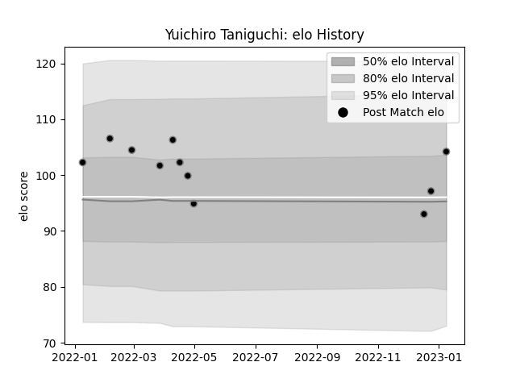

---  
layout: page  
title: Yuichiro Taniguchi  
date: 2023-02-02 18:44:32.302083  
categories: player  
---
# Yuichiro Taniguchi

## Positions: P

## Current elo: 111.0

## Current Percentile: 77.0

# Elo History

# Match History

| Team             |   Appearances |   Win Rate |
|:-----------------|--------------:|-----------:|
| Black Rams Tokyo |            14 |   0.214286 |

| Opponent                          |   Matches |   Win Rate |
|:----------------------------------|----------:|-----------:|
| Toyota Verblitz                   |         3 |   0.333333 |
| Shizuoka Blue Revs                |         2 |   0.5      |
| Toshiba Brave Lupus Tokyo         |         2 |   0        |
| Kubota Spears Funabashi Tokyo-Bay |         1 |   0        |
| Mitsubishi Dynaboars              |         1 |   0        |
| NTT Docomo Red Hurricanes Osaka   |         1 |   1        |
| Saitama Wild Knights              |         1 |   0        |
| Tokyo Sungoliath                  |         1 |   0        |
| Urayasu D-Rocks                   |         1 |   0        |
| Yokohama Canon Eagles             |         1 |   0        |