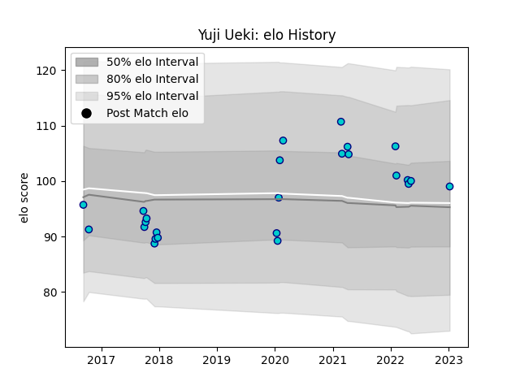

---  
layout: page  
title: Yuji Ueki  
date: 2023-01-13 11:37:25.144673  
categories: player  
---
# Yuji Ueki

## Positions: P

## Current elo: 99.0

## Current Percentile: 68.0

# Elo History

# Match History

| Team               |   Appearances |   Win Rate |
|:-------------------|--------------:|-----------:|
| Shizuoka Blue Revs |            25 |       0.56 |

| Opponent                        |   Matches |   Win Rate |
|:--------------------------------|----------:|-----------:|
| Toshiba Brave Lupus Tokyo       |         4 |        0   |
| Black Rams Tokyo                |         2 |        0.5 |
| Hino Red Dolphins               |         2 |        1   |
| Kobelco Kobe Steelers           |         2 |        0   |
| Munakata Sanix Blues            |         2 |        1   |
| NTT Docomo Red Hurricanes Osaka |         2 |        1   |
| Saitama Wild Knights            |         2 |        0   |
| Toyota Verblitz                 |         2 |        0.5 |
| Coca-Cola Red Sparks            |         1 |        1   |
| Green Rockets Tokatsu           |         1 |        1   |
| Mie Honda Heat                  |         1 |        1   |
| Mitsubishi Dynaboars            |         1 |        1   |
| Tokyo Sungoliath                |         1 |        0   |
| Urayasu D-Rocks                 |         1 |        1   |
| Yokohama Canon Eagles           |         1 |        1   |