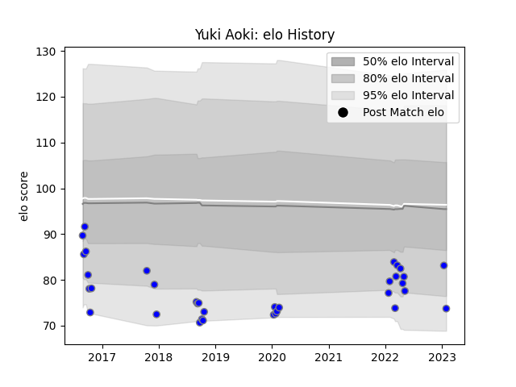

---  
layout: page  
title: Yuki Aoki  
date: 2023-03-17 17:05:55.298183  
categories: player  
---
# Yuki Aoki

## Positions: L

## Current elo: 108.0

## Current Percentile: 75.0

# Elo History

# Match History

| Team                              |   Appearances |   Win Rate |
|:----------------------------------|--------------:|-----------:|
| Kubota Spears Funabashi Tokyo-Bay |            53 |   0.613208 |

| Opponent                         |   Matches |   Win Rate |
|:---------------------------------|----------:|-----------:|
| Urayasu D-Rocks                  |         5 |   0.8      |
| Toshiba Brave Lupus Tokyo        |         5 |   0.6      |
| Shizuoka Blue Revs               |         5 |   0.4      |
| Saitama Wild Knights             |         4 |   0        |
| Green Rockets Tokatsu            |         4 |   0.625    |
| Toyota Verblitz                  |         4 |   0.5      |
| Black Rams Tokyo                 |         3 |   1        |
| Munakata Sanix Blues             |         3 |   1        |
| Mie Honda Heat                   |         3 |   1        |
| Hanazono Kintetsu Liners         |         3 |   0.333333 |
| Yokohama Canon Eagles            |         3 |   0.333333 |
| Coca-Cola Red Sparks             |         2 |   1        |
| Mitsubishi Dynaboars             |         2 |   1        |
| Tokyo Sungoliath                 |         2 |   0        |
| Kobelco Kobe Steelers            |         2 |   0.5      |
| Toyota Industries Shuttles Aichi |         2 |   1        |
| Hino Red Dolphins                |         1 |   1        |