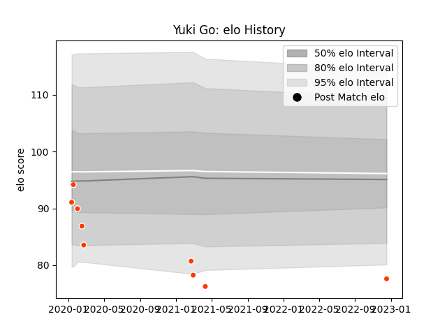

---  
layout: page  
title: Yuki Go  
date: 2023-01-15 11:57:14.854346  
categories: player  
---
# Yuki Go

## Positions: H

## Current elo: 91.0

## Current Percentile: 22.0

# Elo History

# Match History

| Team              |   Appearances |   Win Rate |
|:------------------|--------------:|-----------:|
| Hino Red Dolphins |            21 |   0.333333 |

| Opponent                          |   Matches |   Win Rate |
|:----------------------------------|----------:|-----------:|
| Mie Honda Heat                    |         2 |          0 |
| Green Rockets Tokatsu             |         2 |          1 |
| Kamaishi Seawaves                 |         2 |          1 |
| Shizuoka Blue Revs                |         2 |          0 |
| NTT Docomo Red Hurricanes Osaka   |         1 |          0 |
| Toyota Industries Shuttles Aichi  |         1 |          0 |
| Tokyo Sungoliath                  |         1 |          0 |
| Skyactivs Hiroshima               |         1 |          1 |
| Saitama Wild Knights              |         1 |          0 |
| Black Rams Tokyo                  |         1 |          0 |
| Mitsubishi Dynaboars              |         1 |          0 |
| Chubu Electric Power              |         1 |          1 |
| Kubota Spears Funabashi Tokyo-Bay |         1 |          0 |
| Kobelco Kobe Steelers             |         1 |          0 |
| Hanazono Kintetsu Liners          |         1 |          0 |
| Chugoku Red Regulions             |         1 |          1 |
| Urayasu D-Rocks                   |         1 |          0 |