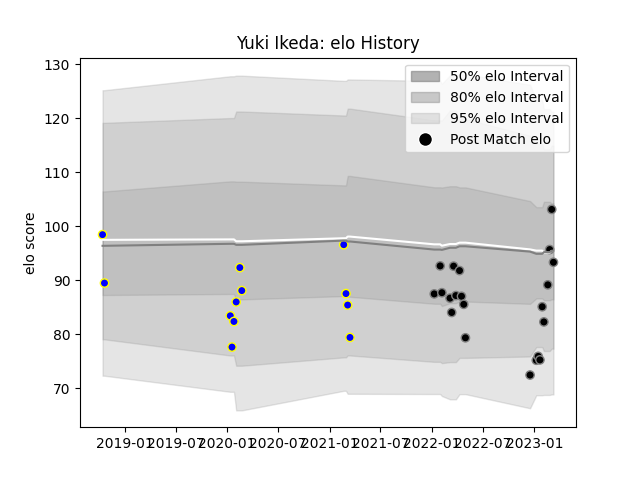

---  
layout: page  
title: Yuki Ikeda  
date: 2023-03-17 17:12:49.837457  
categories: player  
---
# Yuki Ikeda

## Positions: C

## Current elo: 93.0

## Current Percentile: 72.0

# Elo History

# Match History

| Team             |   Appearances |   Win Rate |
|:-----------------|--------------:|-----------:|
| Black Rams Tokyo |            21 |   0.333333 |
| Urayasu D-Rocks  |            12 |   0.541667 |

| Opponent                          |   Matches |   Win Rate |
|:----------------------------------|----------:|-----------:|
| Toyota Verblitz                   |         5 |       0.2  |
| Tokyo Sungoliath                  |         4 |       0    |
| Kubota Spears Funabashi Tokyo-Bay |         3 |       0    |
| Munakata Sanix Blues              |         2 |       1    |
| Kobelco Kobe Steelers             |         2 |       0.5  |
| Mie Honda Heat                    |         2 |       1    |
| Mitsubishi Dynaboars              |         2 |       0.25 |
| Green Rockets Tokatsu             |         2 |       1    |
| Saitama Wild Knights              |         2 |       0    |
| Shizuoka Blue Revs                |         2 |       0.5  |
| Urayasu D-Rocks                   |         1 |       0    |
| Toshiba Brave Lupus Tokyo         |         1 |       0    |
| Black Rams Tokyo                  |         1 |       1    |
| NTT Docomo Red Hurricanes Osaka   |         1 |       1    |
| Hino Red Dolphins                 |         1 |       1    |
| Hanazono Kintetsu Liners          |         1 |       1    |
| Yokohama Canon Eagles             |         1 |       0    |